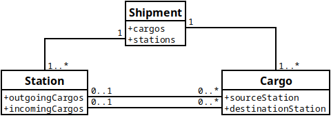

# GLABs API Docs — összesített dokumentáció

_Forrás: https://partnerportal.glabs.me/api-documents/ — oldalankénti mentésekből összefűzve._

## Tartalomjegyzék

- [Getting Started](#sec-getting-started)
  - [Border crossing points](#sec-guides-border-crossing-points)
  - [Handling of cargo operation items](#sec-guides-cargo-operation-items)
  - [Handling of picking items](#sec-guides-picking-items)
  - [Handling of picking locations](#sec-guides-picking-locations)
  - [Handling of cargos](#sec-guides-cargos)
  - [Creating shipment, cargos and stations](#sec-guides-create-shipment-stations-cargos)
  - [Handling of Vehicle entry events](#sec-guides-vehicle-entry-events)
  - [Handling of cargo orders](#sec-guides-cargo-orders)
  - [Handling of unplanned traffics](#sec-guides-unplanned-traffics)
  - [OAuth 2.0](#sec-guides-oauth)
  - [Partners](#sec-guides-partners)
  - [Profile users](#sec-guides-profile-users)
  - [Profiles](#sec-guides-profiles)
    - [Check-in](#sec-guides-station-checkin)
    - [Entry control](#sec-guides-station-crossings)
    - [Loading](#sec-guides-station-stages)
  - [Stations](#sec-guides-stations)
  - [Handling of task comments](#sec-guides-taskcomments)
  - [Handling of task works](#sec-guides-taskworks)
  - [Handling of tasks](#sec-guides-tasks)
  - [Users](#sec-guides-users)
  - [printer](#sec-guides-printer)
  - [Handling of profile user group](#sec-guides-profile-user-groups)
  - [The "resource" resource](#sec-reference-resources)
  - [The "resource_type" resource](#sec-reference-resource-type)
  - [The picking location resource](#sec-reference-picking-locations)
  - [The ramp resource](#sec-reference-ramps)
  - [The shipment resource](#sec-reference-shipments)
  - [The station booking resource](#sec-reference-station-bookings)
  - [The station documentation status](#sec-reference-station-documentation-status)
  - [The station picking status resource](#sec-reference-station-picking-status)
  - [The station resource](#sec-reference-stations)
  - [The station stage resource](#sec-reference-station-stages)
  - [The task comment resource](#sec-reference-taskcomments)
  - [The task resource](#sec-reference-tasks)
  - [The task work resource](#sec-reference-taskworks)
  - [The unplanned traffic resource](#sec-reference-unplanned-traffics)
  - [The user resource](#sec-reference-users)
  - [The vehicle entry event resource](#sec-reference-vehicle-entry-events)
  - [The vehicle entry resource](#sec-reference-vehicle-entries)
  - [borderCrossingPoints](#sec-reference-border-crossing-points)
  - [calls](#sec-reference-calls)
  - [cargoOperationItems](#sec-reference-cargo-operation-items)
  - [cargoOperations](#sec-reference-cargo-operations)
  - [cargoOrders](#sec-reference-cargo-orders)
  - [documentTypes](#sec-reference-document-types)
  - [partners](#sec-reference-partners)
  - [pickingItems](#sec-reference-picking-items)
  - [print-jobs](#sec-reference-print-jobs)
    - [print-job-queues](#sec-reference-print-jobs-print-job-queues)
    - [print-job-tasks](#sec-reference-print-jobs-print-job-tasks)
  - [priorities](#sec-reference-priorities)
  - [profileUserGroups](#sec-reference-profile-user-groups)
  - [profileUsers](#sec-reference-profile-users)
  - [profiles](#sec-reference-profiles)
  - [shipmentCargos](#sec-reference-cargos)
  - [truckWeightMeasurements](#sec-reference-truckweightmeasurements)
- [changelog](#sec-changelog)


<a id="sec-getting-started"></a>

## Getting Started

*Getting Started*

At the beginning we would like to give you a brief overview how can you develop on the GLABs API.

## Standards[​](#standards "Közvetlen hivatkozás erre: Standards")

We make efforts to build a robust and comprehensible API you can use without any struggle. We used industrial standards
to achieve that:

- Our authentication solution is based on the [OAuth 2.0](https://datatracker.ietf.org/doc/html/rfc6749) protocol.
- Our API endpoints follows the rules of REST API recommendations.
- Our datastructures based on the [JSON:API](https://jsonapi.org/).

Note that, we don't discuss features and rules of these standards in this documentation, but we do our best to follow
them. We recommend getting familiar with them for the further readings.

## Authentication[​](#authentication "Közvetlen hivatkozás erre: Authentication")

OAuth 2.0 is a standardized, widely used framework which is easy to use and provides a secure method to exchange sensitive
information. Further information please read our guide:

[How to implement OAuth authentication](https://partnerportal.glabs.me/api-documents/guides/oauth)

## Guides[​](#guides "Közvetlen hivatkozás erre: Guides")

We made detailed guides for all API endpoints you can use to transfer data.

- [Company profiles](https://partnerportal.glabs.me/api-documents/guides/profiles)
- [Creating shipment, cargos and stations](https://partnerportal.glabs.me/api-documents/guides/create-shipment-stations-cargos)
- [Cargos](https://partnerportal.glabs.me/api-documents/guides/cargos)
- [Cargo Operation items](https://partnerportal.glabs.me/api-documents/guides/cargo-operation-items)
- [Picking locations](https://partnerportal.glabs.me/api-documents/guides/picking-locations)
- [Picking items](https://partnerportal.glabs.me/api-documents/guides/picking-items)
- [Cargo Orders](https://partnerportal.glabs.me/api-documents/guides/cargo-orders)
- [Stations](https://partnerportal.glabs.me/api-documents/guides/stations)
  - [Check-in](https://partnerportal.glabs.me/api-documents/guides/station/checkin)
  - [Entry control](https://partnerportal.glabs.me/api-documents/guides/station/crossings)
  - [Loading](https://partnerportal.glabs.me/api-documents/guides/station/stages)
- [Partners](https://partnerportal.glabs.me/api-documents/guides/partners)
- [Printer](https://partnerportal.glabs.me/api-documents/guides/printer)
- [UnplannedTraffic](https://partnerportal.glabs.me/api-documents/guides/unplanned-traffics)
- [ProfileUserGroup](https://partnerportal.glabs.me/api-documents/guides/profile-user-groups)
- [Task](https://partnerportal.glabs.me/api-documents/guides/tasks)
- [TaskWorks](https://partnerportal.glabs.me/api-documents/guides/taskWorks)
- [TaskComments](https://partnerportal.glabs.me/api-documents/guides/taskComments)

## Reference[​](#reference "Közvetlen hivatkozás erre: Reference")

With JSON:API we introduce the "resource concept" to structure our data. All data are typed and well-defined to avoid
misunderstandings. We hope this structure reveals the GLABs' concept of data.

- [Shipment](https://partnerportal.glabs.me/api-documents/reference/shipments/)
- [Station](https://partnerportal.glabs.me/api-documents/reference/stations)
- [Cargo](https://partnerportal.glabs.me/api-documents/reference/cargos/)
- [Cargo Operation](https://partnerportal.glabs.me/api-documents/reference/cargo-operations)
- [Cargo Operation Item](https://partnerportal.glabs.me/api-documents/reference/cargo-operation-items)
- [Picking Location](https://partnerportal.glabs.me/api-documents/reference/picking-locations)
- [Picking Item](https://partnerportal.glabs.me/api-documents/reference/picking-items)
- [Cargo Order](https://partnerportal.glabs.me/api-documents/reference/cargo-orders)
- [Partner](https://partnerportal.glabs.me/api-documents/reference/partners)
- [Profile](https://partnerportal.glabs.me/api-documents/reference/profiles)
- [ProfileUserGroup](https://partnerportal.glabs.me/api-documents/reference/profile-user-groups)
- [UnplannedTraffic](https://partnerportal.glabs.me/api-documents/reference/unplanned-traffics)
- Task Management
  - [Task](https://partnerportal.glabs.me/api-documents/reference/tasks)
  - [TaskWorks](https://partnerportal.glabs.me/api-documents/reference/taskWorks)
  - [TaskComments](https://partnerportal.glabs.me/api-documents/reference/taskComments)
- Print Jobs
  - [Print Job Queues](https://partnerportal.glabs.me/api-documents/reference/print-jobs/print-job-queues)
  - [Print Job Tasks](https://partnerportal.glabs.me/api-documents/reference/print-jobs/print-job-tasks)
  - [Print Jobs](https://partnerportal.glabs.me/api-documents/reference/print-jobs/)

## Common terminology[​](#common-terminology "Közvetlen hivatkozás erre: Common terminology")

rio - Shorthand for resource identifier object (for more see [JSON:API](https://jsonapi.org/))

---


<a id="sec-guides-border-crossing-points"></a>

## Border crossing points

*Guides > Border crossing points*

The "Border crossing point" resources are used to note on the cargo where the truck enters to the destination country,
if the source and destination countries of the cargo are different.

## List `GET /api/partners/{partner_id}/border-crossing-points`[​](#list-get-apipartnerspartner_idborder-crossing-points "Közvetlen hivatkozás erre: list-get-apipartnerspartner_idborder-crossing-points")

Lists the border crossing points of the partner. A partner can define the available list of border crossings, therefore
it's required to query them in relation to the partner.

To query the border crossing points of your company/site, you can lookup
the [`profiles::partner`](https://partnerportal.glabs.me/api-documents/reference/profiles#relationships) field for the partner
level identifier of your company/site.

```
GET /api/partners/{partner_id}/border-crossing-points HTTP/1.1  
Host: {instance}.glabs.me
```

```
$ curl -X GET https://{instance}.glabs.me/api/partners/{partner_id}/border-crossing-points
```

### Query string[​](#query-string "Közvetlen hivatkozás erre: Query string")

| Parameter | Type | Description |
| --- | --- | --- |
| filter[host] | string | Filters border crossing points for the given host country code. |

## Border crossing points on cargo[​](#border-crossing-points-on-cargo "Közvetlen hivatkozás erre: Border crossing points on cargo")

Border crossing points can be noted by organizers, forwarders or carriers. These actors can note this on
the [`cargos::borderCrossingPoint`](https://partnerportal.glabs.me/api-documents/reference/cargos/#relationships) field.

## Border crossing points on cargo operation[​](#border-crossing-points-on-cargo-operation "Közvetlen hivatkozás erre: Border crossing points on cargo operation")

Border crossing points also can be noted by a company/site user as well as the driver through a kiosk. This
information is recorded on the [`cargoOperations::borderCrossingPoint`](https://partnerportal.glabs.me/api-documents/reference/cargo-operations#relationships)
field.

---


<a id="sec-guides-cargo-operation-items"></a>

## Handling of cargo operation items

*Guides > Cargo operations > Handling of cargo operation items*

## Create `POST /api/{profile_id}/cargo-operations/{cargo_operation_id}/items`[​](#create-post-apiprofile_idcargo-operationscargo_operation_iditems "Közvetlen hivatkozás erre: create-post-apiprofile_idcargo-operationscargo_operation_iditems")

You can add a new cargo operation items to a cargo operation in this endpoint.
The constraints of the attributes are detailed below.

*Required OAuth scope: shipments*

```
POST /api/{profile_id}/cargo-operations/{cargo_operation_id}/items HTTP/1.1  
Host: {instance}.glabs.me  
  
{  
	"data": {  
        "type": "cargoOperationItems",  
        "attributes": {  
            "remoteId": "R01",  
            "code": "K00550101",  
            "name": "Good product",  
            "quantity": 4.0,  
            "comment": "Integer quis magna ut nulla commodo dignissim nec id est.",  
            "quantityForPickingLocation": 2.0,  
            "pickingQuantity": 1.2,  
            "loadedQuantity": 3.6,  
            "stockInfo": 2.4  
        },  
        "relationships": {  
            "cargoOperation": {  
                "data": { "type": "cargoOperations", "id": "fca79551-fd7e-4a2b-bed0-c5e0e624815d" }  
            },  
            "quantityUnit": {  
                "data": { "type": "quantityUnits", "id": "fca79551-fd7e-4a2b-bed0-c5e0e624815c" }  
            }  
        }  
    }  
}
```

The server response will contain the created cargo operation items object with it's generated id. [See reference](https://partnerportal.glabs.me/api-documents/reference/cargo-operation-items).

---

## Update `PATCH /api/{profile_id}/cargo-operations/{cargo_operation_id}/items/{id}`[​](#update-patch-apiprofile_idcargo-operationscargo_operation_iditemsid "Közvetlen hivatkozás erre: update-patch-apiprofile_idcargo-operationscargo_operation_iditemsid")

You can update a cargo operation items resource in this endpoint.
Note: In an update request you don't have to send the fields you don't want to modify.
The constraints of the attributes are detailed below.

*Required OAuth scope: shipments*

```
PATCH /api/{profile_id}/cargo-operations/{cargo_operation_id}/items/{id} HTTP/1.1  
Host: {instance}.glabs.me  
  
{  
	"data": {  
        "type": "cargoOperationItems",  
        "id": "47f8f549-c205-40c6-94f3-432283bbdad9",  
        "attributes": {  
           "remoteId": "R01",  
           "code": "K00550101",  
           "name": "Good product",  
           "quantity": 4.0,  
           "comment": "Integer quis magna ut nulla commodo dignissim nec id est.",  
           "quantityForPickingLocation": 2.0,  
           "pickingQuantity": 1.2,  
           "loadedQuantity": 3.6,  
           "stockInfo": 2.4  
        }  
    }  
}
```

---

## Remove `DELETE /api/{profile_id}/cargo-operations/{cargo_operation_id}/items/{id}`[​](#remove-delete-apiprofile_idcargo-operationscargo_operation_iditemsid "Közvetlen hivatkozás erre: remove-delete-apiprofile_idcargo-operationscargo_operation_iditemsid")

You can remove a cargo operation items from a cargo operation in this endpoint.
Be aware: this operation is irreversible!

*Required OAuth scope: shipments*

```
DELETE /api/{profile_id}/cargo-operations/{cargo_operation_id}/items/{id} HTTP/1.1  
Host: {instance}.glabs.me
```

---

## Constraints[​](#constraints "Közvetlen hivatkozás erre: Constraints")

Some attribute values may be restricted on creation or update, depending on the station's and the cargo-operation's statuses.

### Comment, Stock info, Remote id:[​](#comment-stock-info-remote-id "Közvetlen hivatkozás erre: Comment, Stock info, Remote id:")

No constraints at all.

### Name, Code, Quantity unit:[​](#name-code-quantity-unit "Közvetlen hivatkozás erre: Name, Code, Quantity unit:")

You can not update these fields when:

- the picking is in progress
- the picking is finished
- the loading is started

On creation there are no constraints.

### Quantity:[​](#quantity "Közvetlen hivatkozás erre: Quantity:")

You can not update when:

- the station's picking is in progress and the cargo-operation's picking status is not "picked"
- the station is in loading stage and the cargo-operation's loading status is not "loaded"
- the station's loading is closed
- the given quantity is less than the total picked quantity and the station's loading is not started

On creation there are no constraints.

### Quantity for picking location:[​](#quantity-for-picking-location "Közvetlen hivatkozás erre: Quantity for picking location:")

You can not create or update with non-zero value when:

- the station's picking is in progress and the operation's picking status is not "picked"
- the station is in loading stage
- the station's loading is closed

### Picked quantity:[​](#picked-quantity "Közvetlen hivatkozás erre: Picked quantity:")

You can not update when:

- the station is marked not appeared
- the station is rejected
- the station's loading is started

On creation you cannot set this field.

### Loaded quantity:[​](#loaded-quantity "Közvetlen hivatkozás erre: Loaded quantity:")

You can not update when:

- the station is not checked in
- the station's loading is closed

On creation you cannot set this field.

### Multi-field constraints[​](#multi-field-constraints "Közvetlen hivatkozás erre: Multi-field constraints")

The quantity cannot be less than the quantity for picking location in any situation.

---

## Possible error codes detailed[​](#possible-error-codes-detailed "Közvetlen hivatkozás erre: Possible error codes detailed")

| Error code | Description |
| --- | --- |
| not\_checked\_in | The station is not checked in. |
| not\_appeared | The station is marked as not appeared. |
| rejected | The station is rejected. |
| picking\_is\_in\_progress | The station's picking status is not null and not "closed". |
| picking\_is\_finished | The cargo-operation is marked as picked. |
| loading\_is\_started | The station's stage is not null or "waiting". |
| loading\_is\_in\_progress | The station's stage is "inprogress" or "loading". |
| loading\_is\_closed | The station's stage is "closed". |
| quantity\_less\_than\_picked\_quantity | The quantity is less than the total picked quantity. |
| quantity\_is\_less\_than\_quantity\_for\_picking\_location | The quantity is less than the quantity for picking location. |
| not\_allowed\_on\_creation | The field's value cannot be set on creation. |

---


<a id="sec-guides-picking-items"></a>

## Handling of picking items

*Guides > Cargo operations > Handling of picking items*

## Create `POST /api/{profile_id}/stations/{station_id}/picking-locations/{picking_location_id}/items`[​](#create-post-apiprofile_idstationsstation_idpicking-locationspicking_location_iditems "Közvetlen hivatkozás erre: create-post-apiprofile_idstationsstation_idpicking-locationspicking_location_iditems")

You can add a new picking items to a location on a station in this endpoint.

*Required OAuth scope: shipments*

```
POST /api/{profile_id}/stations/{station_id}/picking-locations/{picking_location_id}/items HTTP/1.1  
Host: {instance}.glabs.me  
  
{  
	"data": {  
        "type": "pickingItems",  
         "attributes": {  
              "quantity": 4.0  
            },  
          "relationships": {  
            "cargoItem": {  
              "data": { "type": "cargoOperationItems", "id": "fca79551-fd7e-4a2b-bed0-c5e0e624815c" }  
            },  
            "pickingLocation": {  
              "data": { "type": "pickingLocations", "id": "fca79551-fd7e-4a2b-bed0-c5e0e624815c" }  
            }  
         }  
    }  
}
```

The server response will contain the created picking item object with it's generated id. [See reference](https://partnerportal.glabs.me/api-documents/reference/picking-items)

---

## Update `PATCH /api/{profile_id}/stations/{station_id}/picking-locations/{picking_location_id}/items/{id}`[​](#update-patch-apiprofile_idstationsstation_idpicking-locationspicking_location_iditemsid "Közvetlen hivatkozás erre: update-patch-apiprofile_idstationsstation_idpicking-locationspicking_location_iditemsid")

You can update a picking item resource in this endpoint.
Note: In an update request you don't have to send the fields you don't want to modify.

*Required OAuth scope: shipments*

```
PATCH /api/{profile_id}/stations/{station_id}/picking-locations/{picking_location_id}/items/{id} HTTP/1.1  
Host: {instance}.glabs.me  
  
{  
	"data": {  
        "type": "pickingItems",  
        "id": "47f8f549-c205-40c6-94f3-432283bbdad9",  
        "attributes": {  
          "quantity": 3.2  
        }  
    }  
}
```

---

## Remove `DELETE /api/{profile_id}/stations/{station_id}/picking-locations/{picking_location_id}/items/{id}`[​](#remove-delete-apiprofile_idstationsstation_idpicking-locationspicking_location_iditemsid "Közvetlen hivatkozás erre: remove-delete-apiprofile_idstationsstation_idpicking-locationspicking_location_iditemsid")

You can remove a picking item from a picking location in this endpoint.
Be aware: this operation is irreversible!

*Required OAuth scope: shipments*

```
DELETE /api/{profile_id}/stations/{station_id}/picking-locations/{picking_location_id}/items/{id} HTTP/1.1  
Host: {instance}.glabs.me
```

---


<a id="sec-guides-picking-locations"></a>

## Handling of picking locations

*Guides > Cargo operations > Handling of picking locations*

## Create `POST /api/{profile_id}/stations/{station_id}/picking-locations`[​](#create-post-apiprofile_idstationsstation_idpicking-locations "Közvetlen hivatkozás erre: create-post-apiprofile_idstationsstation_idpicking-locations")

You can add a new picking location to a station in this endpoint.

*Required OAuth scope: shipments*

Example for the cargo picking location type:

```
POST /api/{profile_id}/stations/{station_id}/picking-locations HTTP/1.1  
Host: {instance}.glabs.me  
  
{  
	"data": {  
        "type": "cargoPickingLocations",  
        "attributes": {  
          "name": "Picking location #1",  
          "packingType": "pallet"  
        },  
        "relationships": {  
            "station": {  
                "data": { "type": "shipmentStations", "id": "AA001-AB" }  
            },  
            "cargoOperation": {  
                "data": { "type": "cargoOperations", "id": "fca79551-fd7e-4a2b-bed0-c5e0e624815c" }  
            }  
        }  
    }  
}
```

Example for the partner picking location type:

```
POST /api/{profile_id}/stations/{station_id}/picking-locations HTTP/1.1  
Host: {instance}.glabs.me  
  
{  
	"data": {  
        "type": "partnerPickingLocations",  
        "attributes": {  
          "name": "Picking location #2",  
          "packingType": "package"  
        },  
        "relationships": {  
            "station": {  
                "data": { "type": "shipmentStations", "id": "AA001-AB" }  
            },  
            "partner": {  
                "data": { "type": "partners", "id": "fca79551-fd7e-4a2b-bed0-c5e0e624815c" }  
            }  
        }  
    }  
}
```

The server response will contain the created picking location object with it's generated id. [See reference](https://partnerportal.glabs.me/api-documents/reference/picking-locations)

---

## Update `PATCH /api/{profile_id}/stations/{station_id}/picking-locations/{id}`[​](#update-patch-apiprofile_idstationsstation_idpicking-locationsid "Közvetlen hivatkozás erre: update-patch-apiprofile_idstationsstation_idpicking-locationsid")

You can update a picking location resource in this endpoint.
Note: In an update request you don't have to send the fields you don't want to modify.

*Required OAuth scope: shipments*

```
PATCH /api/{profile_id}/stations/{station_id}/picking-locations/{id} HTTP/1.1  
Host: {instance}.glabs.me  
  
{  
	"data": {  
        "type": "cargoPickingLocations",  
        "id": "47f8f549-c205-40c6-94f3-432283bbdad9",  
        "attributes": {  
          "name": "Picking location #3",  
          "packingType": "custom",  
          "loadingStatus": "loaded"  
        }  
    }  
}
```

The method is same for the partner picking location resource, only the type changes to 'partnerPickingLocations'.

---

## Remove `DELETE /api/{profile_id}/stations/{station_id}/picking-locations/{id}`[​](#remove-delete-apiprofile_idstationsstation_idpicking-locationsid "Közvetlen hivatkozás erre: remove-delete-apiprofile_idstationsstation_idpicking-locationsid")

You can remove a picking location from a station in this endpoint.
Be aware: this operation is irreversible!

*Required OAuth scope: shipments*

```
DELETE /api/{profile_id}/stations/{station_id}/picking-locations/{id} HTTP/1.1  
Host: {instance}.glabs.me
```

---


<a id="sec-guides-cargos"></a>

## Handling of cargos

*Guides > Cargos > Handling of cargos*

## Create[​](#create "Közvetlen hivatkoz�ás erre: Create")

The creation of a cargo is detailed in [this guide](https://partnerportal.glabs.me/api-documents/guides/create-shipment-stations-cargos).

Also check out the [cargo resource reference](https://partnerportal.glabs.me/api-documents/reference/cargos/).

## Update `PATCH /api/{profile_id}/shipments/{shipment_id}/cargos/{cargo_id}`[​](#update-patch-apiprofile_idshipmentsshipment_idcargoscargo_id "Közvetlen hivatkozás erre: update-patch-apiprofile_idshipmentsshipment_idcargoscargo_id")

You can update a cargo resource in this endpoint.

Note: In an update request you don't have to send the fields you don't want to modify.

*Required OAuth scope: shipments*

```
PATCH /api/{profile_id}/shipments/{shipment_id}/cargos/{cargo_id} HTTP/1.1  
Host: {instance}.glabs.me  
  
{  
	"data": {  
        "type": "shipmentCargos",  
        "id": "TS1234#001",  
        "attributes": {  
            "number": "CGO86065273",  
            "colli": "15",  
            "comment": "Mauris id ligula commodo, imperdiet turpis sit amet, fringilla mi.",  
            "ekaerCode": "EKAER-TC2021-0001",  
            "totalWeight": 23.5  
        }  
    }  
}
```

---

## Remove `DELETE /api/{profile_id}/shipments/{shipment_id}/cargos/{cargo_id}`[​](#remove-delete-apiprofile_idshipmentsshipment_idcargoscargo_id "Közvetlen hivatkozás erre: remove-delete-apiprofile_idshipmentsshipment_idcargoscargo_id")

You can remove a cargo resource in this endpoint by {cargo\_id} parameter.

A cargo can only be removed by the related shipment's organizer

A cargo cannot be removed in the following conditions:

- It is the last cargo in the shipment
- It is the last cargo in a related checked-in station
- It is related to a closed station

Related stations are removed in case no cargo left related to them.

*Required OAuth scope: shipments*

```
DELETE /api/{profile_id}/shipments/{shipment_id}/cargos/{cargo_id} HTTP/1.1  
Host: {instance}.glabs.me
```

```
$ curl -X DELETE https://{instance}.glabs.me/api/{profile_id}/shipments/{shipment_id}/cargos/{cargo_id}
```

### Example response[​](#example-response "Közvetlen hivatkozás erre: Example response")

```
HTTP/1.1 204 No Content  
Content-Type: application/json;charset=utf-8  
Cache-Control: no-store  
Pragma: no-cache
```

---


<a id="sec-guides-create-shipment-stations-cargos"></a>

## Creating shipment, cargos and stations

*Guides > Creating shipment, cargos and stations*

## Shipments[​](#shipments "Közvetlen hivatkozás erre: Shipments")

The main entity in the GLABs is the *shipment* which represents the transportation of cargos between sites. Shipments
are used to aggregate cargos transported by one carrier to possibly multiple sites.

A *shipment* is implicitly created when you create a new cargo. New cargos can be added to this *shipment* afterward.

## Cargos[​](#cargos "Közvetlen hivatkozás erre: Cargos")

A cargo represents a package which is transported from one site to another. A cargo always defined by a *source* site
where the package is coming from and a *destination* site where the package is going to.

You should define both sites with a *partner* entity you registered. Usually you define a cargo between your company and
one of your *partners*. Therefore your company profile has a dedicated *partner* entity, called *profile partner*.

To create an outgoing cargo, define the *source* site as your *profile partner* and one of your *partners* as the \*
destination\*.
To create an incoming cargo, define the *source* site as one of your *partners* and your *profile partner* as the \*
destination\*.

## Stations[​](#stations "Közvetlen hivatkozás erre: Stations")

A *station* represents a detailed loading or unloading on a site: the booking time, loading status, check-in and many
more features.

When you register a cargo, a *station* is automatically created on the site (*source*/*destination*) where your *profile
partner* is defined. For the creation of the *station* a *shipment* rule is required, therefore you must pass a \*
shipment\* rule alongside with your *profile partner*.

Stations and their features are only available for GLABs clients, it means on the side of your *partners* no *stations*
will be created. Currently the system requires at least one *station* in a cargo.

## Cargo operations[​](#cargo-operations "Közvetlen hivatkozás erre: Cargo operations")

A *cargo operation* represents a cargo's loading on a station including picking, loading and items.

Cargo operations created automatically for stations upon creation, you dont need to specify it. Nevertheless if you want
to set its properties or add items while creating a new cargo you can define it.

## Adding cargo to existing station[​](#adding-cargo-to-existing-station "Közvetlen hivatkozás erre: Adding cargo to existing station")

You can add additional cargos to your existing *station*. In this case, to avoid new *station* creation, you should
define the *station* on the side you would place your *profile partner*. Obviously you still must define the *partner*
on the other side.

## UML representation of the shipment-station-cargo relationship[​](#uml-representation-of-the-shipment-station-cargo-relationship "Közvetlen hivatkozás erre: UML representation of the shipment-station-cargo relationship")



## Examples[​](#examples "Közvetlen hivatkozás erre: Examples")

### Add cargo to new shipment `POST /api/{profile_id}/shipments/cargos`[​](#add-cargo-to-new-shipment-post-apiprofile_idshipmentscargos "Közvetlen hivatkozás erre: add-cargo-to-new-shipment-post-apiprofile_idshipmentscargos")

In this example we are creating a new cargo for a new shipment:

- We define ourselves as a source side partner. (data.relationships.sourcePartnerOrigin)
- Supplied with the shipment rule for the station creation. (data.relationships.sourceStation.relationships.shipmentRuleOrigin)
- And define a partner on the destination side. (data.relationships.destinationPartnerOrigin)

*Required OAuth scope: shipments*

```
POST /api/{profile_id}/shipments/cargos HTTP/1.1  
Host: {instance}.glabs.me  
  
{  
  "data": {  
    "type": "shipmentCargos",  
    "relationships": {  
      "sourcePartnerOrigin": {  
        "data": { "type": "partners", "id": "064ed7de-39f3-4206-a592-72ae6151eaa6" }  
      },  
      "sourceStation": {  
        "data": { "pointer": "/included/0" }  
      },  
      "destinationPartnerOrigin": {  
        "data": { "type": "partners", "id": "594d5565-7f48-4a4d-8478-75f41c627d04" }  
      }  
    }  
  },  
  "included": [  
    {  
      "type": "shipmentStations",  
      "relationships": {  
        "shipmentRuleOrigin": {  
          "data": { "type": "shipmentRules", "id": "shipmentRuleId" }  
        }  
      }  
    }  
  ]  
}
```

On success this endpoint's response will always contain the newly created cargo resource and the related shipment
and station resources. In this example all three resources are created in the same action:

```
HTTP/1.1 201 OK  
Content-Type: application/json;charset=utf-8  
Cache-Control: no-store  
Pragma: no-cache  
  
{  
  "data": {  
    "type": "shipmentCargos",  
    "id": "AA123#001",  
    "attributes": {  
      "sourcePartner": {  
        "name": "Acme Ltd."  
      },  
      "destinationPartner": {  
        "name": "FooBar Co."  
      },  
      "number": null,  
      "colli": null,  
      "comment": null,  
      "ekaerCode": null,  
      "totalWeight": null  
    },  
    "relationships": {  
      "shipment": {  
        "data": { "type": "shipments", "id": "AA123" }  
      },  
      "sourceStation": {  
        "data": { "type": "shipmentStations", "id": "AA123-AB" }  
      },  
      "sourceOperation": {  
        "data": { "type": "cargoOperations", "id": "064ed7hj-39f3-4206-a592-72ae6151eaa6"}  
      },  
      "sourcePartnerOrigin": {  
        "data": { "type": "partners", "id": "064ed7de-39f3-4206-a592-72ae6151eaa6" }  
      },  
      "destinationPartnerOrigin": {  
        "data": { "type": "partners", "id": "594d5565-7f48-4a4d-8478-75f41c627d04" }  
      }  
    }  
  },  
  "included": [  
    {  
      "type": "shipments",  
      "id": "AA123",  
      "attributes": { "..." },  
      "relationships": { "..." }  
    },  
    {  
      "type": "shipmentStations",  
      "id": "AA123-AB",  
      "attributes": { "..." },  
      "relationships": { "..." }  
    },  
    {  
      "type": "cargoOperations",  
      "id": "064ed7hj-39f3-4206-a592-72ae6151eaa6",  
      "attributes": { "..." },  
      "relationships": { "..." }  
    }  
  ]  
}
```

### Add to existing shipment `POST /api/{profile_id}/shipments/{shipment_id}/cargos`[​](#add-to-existing-shipment-post-apiprofile_idshipmentsshipment_idcargos "Közvetlen hivatkozás erre: add-to-existing-shipment-post-apiprofile_idshipmentsshipment_idcargos")

In this example we are creating a new cargo for an existing shipment and station:

- We reuse our previously created station as a source side station. (data.relationships.sourceStation)
- Define a partner on the destination side. (data.relationships.destinationPartnerOrigin)
- It is required to define the shipment we are adding the cargo to. (data.relationships.shipment)

*Required OAuth scope: shipments*

```
POST /api/{profile_id}/shipments/{shipment_id}/cargos HTTP/1.1  
Host: {instance}.glabs.me  
  
{  
  "data": {  
    "type": "shipmentCargos",  
    "relationships": {  
      "shipment": {  
        "data": { "type": "shipments", "id": "AA123" }  
      },  
      "sourceStation": {  
        "data": { "type": "shipmentStations", "id": "AA123-AB" }  
      },  
      "destinationPartnerOrigin": {  
        "data": { "type": "partners", "id": "0ba38a1a-ce08-4e70-9894-0b23e46503cf" }  
      }  
    }  
  }  
}
```

### Cargo with operation attributes and items[​](#cargo-with-operation-attributes-and-items "Közvetlen hivatkozás erre: Cargo with operation attributes and items")

You can define operation attributes and cargo items in the previous cases as well.

We have to note that, we use a feature "side posting" - in order to allow posting cargo operations and items together with cargo - which
is not a part of the JSON:API yet, but we followed the related feature proposal discussed [here](https://github.com/json-api/json-api/pull/1197).

The cargo operation resource details are described in the [cargo operation resource](https://partnerportal.glabs.me/api-documents/reference/cargo-operations) section.

```
POST /api/{profile_id}/shipments/{shipment_id}/cargos HTTP/1.1  
Host: {instance}.glabs.me  
  
{  
  "data": {  
    "type": "shipmentCargos",  
    "attributes": {  
      "number": "CGO86065273",  
      "colli": "15",  
      "comment": "Mauris id ligula commodo, imperdiet turpis sit amet, fringilla mi.",  
      "ekaerCode": "EKAER-TC2021-0001",  
      "totalWeight": 23.5  
    },  
    "relationships": {  
      "shipment": {  
        "data": { "type": "shipments", "id": "AA123" }  
      },  
      "sourceStation": {  
        "data": { "type": "shipmentStations", "id": "AA123-AB" }  
      },  
      "sourceOperation": {  
        "data": { "pointer": "/included/0" }  
      },  
      "destinationPartnerOrigin": {  
        "data": { "type": "partners", "id": "ec81e3b9-dec8-4b99-bcde-c611d9778660" }  
      }  
    }  
  },  
  "included": [  
    {  
      "type": "cargoOperations",  
      "attributes": { "..." },  
      "relationships": {  
          "items": {  
            "data": [  
               { "pointer": "/included/1" },  
               { "pointer": "/included/2" }  
            ]  
          }  
        }  
    },  
    {  
      "type": "cargoOperationItems",  
      "attributes": { "..." },  
      "relationships": { "..." }  
    },  
    {  
      "type": "cargoOperationItems",  
      "attributes": { "..." },  
      "relationships": { "..." }  
    }  
  ]  
}
```

The order of the cargo items are maintained, so you can rely on that when you parse the response.

As in the previous examples the response will include not just the cargo, shipment, stations resources but the cargo items too.

```
HTTP/1.1 201 OK  
Content-Type: application/json;charset=utf-8  
Cache-Control: no-store  
Pragma: no-cache  
  
{  
  "data": {  
    "type": "shipmentCargos",  
    "id": "AA123#003",  
    "attributes": {  
      "sourcePartner": {  
        "name": "Acme Ltd."  
      },  
      "destinationPartner": {  
        "name": "Turner Group"  
      },  
      "number": "CGO86065273",  
      "colli": "15",  
      "comment": "Mauris id ligula commodo, imperdiet turpis sit amet, fringilla mi.",  
      "ekaerCode": "EKAER-TC2021-0001",  
      "totalWeight": 23.5  
    },  
    "relationships": {  
      "shipment": {  
        "data": { "type": "shipments", "id": "AA123" }  
      },  
      "sourceStation": {  
        "data": { "type": "shipmentStations", "id": "AA123-BE" }  
      },  
      "sourceOperation": {  
        "data": { "type": "partners", "id": "8f7de4b5-c352-4c41-94bc-aa682a4de947" }  
      },  
      "sourcePartnerOrigin": {  
        "data": { "type": "partners", "id": "064ed7de-39f3-4206-a592-72ae6151eaa6" }  
      },  
      "destinationPartnerOrigin": {  
        "data": { "type": "partners", "id": "ec81e3b9-dec8-4b99-bcde-c611d9778660" }  
      }  
    }  
  },  
  "included": [  
    {  
      "type": "shipments",  
      "id": "AA123",  
      "attributes": { "..." },  
      "relationships": { "..." }  
    },  
    {  
      "type": "shipmentStations",  
      "id": "AA123-BE",  
      "attributes": { "..." },  
      "relationships": { "..." }  
    },  
    {  
      "type": "cargoOperations",  
      "id": "8f7de4b5-c352-4c41-94bc-aa682a4de947",  
      "attributes": { "..." },  
      "relationships": { "..." }  
    },  
    {  
      "type": "cargoOperationItems",  
      "id": "6f7de4b5-c352-4c41-94bc-aa682a4de947",  
      "attributes": { "..." },  
      "relationships": { "..." }  
    },  
    {  
      "type": "cargoOperationItems",  
      "id": "6f7de4b5-c352-4c41-94bc-aa682a4de948",  
      "attributes": { "..." },  
      "relationships": { "..." }  
    }  
  ]  
}
```

### Cargo with shipment attributes[​](#cargo-with-shipment-attributes "Közvetlen hivatkozás erre: Cargo with shipment attributes")

When creating a new shipment you can define shipment attributes by defining the shipment resource.
This can be combined with the previous cases but only when creating a new shipment. An existing shipments attributes
cannot be updated on this endpoint.

We use "side posting" as mentioned in the previous example.

```
POST /api/{profile_id}/shipments/cargos HTTP/1.1  
Host: {instance}.glabs.me  
  
{  
  "data": {  
    "type": "shipmentCargos",  
    "relationships": {  
      "shipment": {  
        "data": { "pointer": "/included/0" }  
      },  
      "sourcePartnerOrigin": {  
        "data": { "type": "partners", "id": "064ed7de-39f3-4206-a592-72ae6151eaa6" }  
      },  
      "destinationPartnerOrigin": {  
        "data": { "type": "partners", "id": "594d5565-7f48-4a4d-8478-75f41c627d04" }  
      },  
      "sourceStation": {  
        "data": { "pointer": "/included/1" }  
      }  
    }  
  },  
  "included": [  
    {  
      "type": "shipments",  
      "attributes": {  
        "vehicleIds": ["ABC123", "DEF456"],  
        "transportId": "123456",  
        "driver": {  
          "name": "John Doe",  
          "phoneNumber": "112233",  
          "phoneCountryCode": "+00"  
        }  
      }  
    },  
    {  
      "type": "shipmentStations",  
      "relationships": {  
        "shipmentRuleOrigin": {  
          "data": { "type": "shipmentRules", "id": "shipmentRuleId" }  
        }  
      }  
    }  
  ]  
}
```

The newly created shipment - set up with the given attributes - will be included in the response as always.
The shipment resource details are described in the [shipment resource](https://partnerportal.glabs.me/api-documents/reference/shipments/) section.

```
HTTP/1.1 201 OK  
Content-Type: application/json;charset=utf-8  
Cache-Control: no-store  
Pragma: no-cache  
  
{  
  "data": {  
    "type": "shipmentCargos",  
    "id": "AA123#003",  
    "attributes": {  
      "sourcePartner": {  
        "name": "Acme Ltd."  
      },  
      "destinationPartner": {  
        "name": "Turner Group"  
      },  
      "number": null,  
      "colli": null,  
      "comment": null,  
      "ekaerCode": null,  
      "totalWeight": null  
    },  
    "relationships": {  
      "shipment": {  
        "data": { "type": "shipments", "id": "AA123" }  
      },  
      "sourceStation": {  
        "data": { "type": "shipmentStations", "id": "AA123-AB" }  
      },  
      "sourcePartnerOrigin": {  
        "data": { "type": "partners", "id": "064ed7de-39f3-4206-a592-72ae6151eaa6" }  
      },  
      "destinationPartnerOrigin": {  
        "data": { "type": "partners", "id": "ec81e3b9-dec8-4b99-bcde-c611d9778660" }  
      }  
    }  
  },  
  "included": [  
    {  
      "type": "shipments",  
      "id": "AA123",  
      "attributes": { "..." },  
      "relationships": { "..." }  
    },  
    {  
      "type": "shipmentStations",  
      "id": "AA123-BE",  
      "attributes": { "..." },  
      "relationships": { "..." }  
    }  
  ]  
}
```

---


<a id="sec-guides-vehicle-entry-events"></a>

## Handling of Vehicle entry events

*Guides > Handling of Vehicle entry events*

## Create `POST /api/{profile_id}/vehicle-entry-events`[​](#create-post-apiprofile_idvehicle-entry-events "Közvetlen hivatkozás erre: create-post-apiprofile_idvehicle-entry-events")

*Required OAuth scope: entry*

You can create a new vehicle entry event in this endpoint,
of which represents an enter or an exit of a truck from/to the site.

The plate number can be an uppercase alphanumerical string,
without any whitespaces or special characters.
The whitespace and special characters will be sanitized.

Direction defines the event was an enter or an exit.

The time attribute is optional, if you don't specify it the actual time will be used.

```
POST /api/{profile_id}/vehicle-entry-events HTTP/1.1  
Host: {instance}.glabs.me  
  
{  
    "data": {  
        "type": "vehicleEntryEvents",  
        "attributes": {  
            "plateNumber": "ABC123",  
            "direction": "enter",  
            "time": 1638363292  
        }  
    }  
}
```

The server response will contain the created vehicle entry event. [See reference](https://partnerportal.glabs.me/api-documents/reference/vehicle-entry-events).

---

## Update `PATCH /api/{profile_id}/vehicle-entry-events/{id}`[​](#update-patch-apiprofile_idvehicle-entry-eventsid "Közvetlen hivatkozás erre: update-patch-apiprofile_idvehicle-entry-eventsid")

*Required OAuth scope: entry*

You can update a vehicle entry event in this endpoint.

It can only be undone a vehicle entry event.

```
PATCH /api/{profile_id}/vehicle-entry-events HTTP/1.1  
Host: {instance}.glabs.me  
  
{  
    "data": {  
        "type": "vehicleEntryEvents",  
        "attributes": {  
            "undone": true  
        }  
    }  
}
```

The server response will contain the created vehicle entry event. [See reference](https://partnerportal.glabs.me/api-documents/reference/vehicle-entry-events).

---

## List `GET /api/{profile_id}/vehicle-entry-events`[​](#list-get-apiprofile_idvehicle-entry-events "Közvetlen hivatkozás erre: list-get-apiprofile_idvehicle-entry-events")

*Required OAuth scope: entry*

You can list vehicle entries.

```
GET /api/{profile_id}/vehicle-entry-events HTTP/1.1  
Host: {instance}.glabs.me
```

### Example[​](#example "Közvetlen hivatkozás erre: Example")

```
{  
  "data": {  
      "type": "vehicleEntryEvents",  
      "id": "d93b5131-38f2-492e-a33d-ddc506f4fee4",  
      "attributes": {  
        "createdAt": 1635501045,  
        "plateNumber": "44",  
        "direction": "exit",  
        "time": 1659088245,  
        "undoneAt": 1659088275  
                },  
      "relationships": {  
        "creator": {  
          "data": {  
            "type": "profileUsers",  
            "id": "a64b42c7-2de3-4aa7-9c14-03483724bcc6"  
          }  
        },  
        "undoneBy": {  
          "data": {  
            "type": "profileUsers",  
            "id": "a64b42c7-2de3-4aa7-9c14-03483724bcc6"  
          }  
        }  
      }  
   },  
  "included": [],  
  "meta": {  
    "pagination": {  
      "resultsTotal": 1,  
      "pageNumber": 1,  
      "pageSize": 20,  
      "pageTotal": 1  
    }  
  },  
  "links": {  
  	"self": "https://{instance}.glabs.me/api/{profile_id}/vehicle-entry-events",  
  	"first": "https://{instance}.glabs.me/api/{profile_id}/vehicle-entry-events?page[number]=1",  
  	"prev": "https://{instance}.glabs.me/api/{profile_id}/vehicle-entry-events?page[number]=2",  
  	"next": null,  
  	"last": null  
  }  
}
```

### Query string[​](#query-string "Közvetlen hivatkozás erre: Query string")

| Parameter | Type | Description |
| --- | --- | --- |
| filter[plateNumberLike] | string | Filter vehicle entries by plate number. |
| filter[eventTimeStart] | timestamp | Lowest vehicle entries by entered date filtered. |
| filter[eventTimeEnd] | timestamp | Highest vehicle entries by entered date filtered. |
| filter[direction] | string | Filter vehicle entries by status. Options are "enter" or "exit". |
| page[number] | integer | Page number |
| sort | string | Sort option |

### Pagination[​](#pagination "Közvetlen hivatkozás erre: Pagination")

Pagination is required for displaying large result sets.

To control the pagination the query string must contain the `page[number]` parameter.
If this is omitted the default is `page[number]=1` which gives a result set of the first 20 items.

The result set is always affected by the filters.

### Sorting[​](#sorting "Közvetlen hivatkozás erre: Sorting")

You can query a sorted list using the `sort` query parameter described in the following link:

<https://jsonapi.org/format/#fetching-sorting>

The supported sorting options are:

- plateNumber (sorts alphabet by the event plateNumber)
- direction (sorts alphabet by the event direction)
- time (sorts by the event time)

---


<a id="sec-guides-cargo-orders"></a>

## Handling of cargo orders

*Guides > Handling of cargo orders*

##### since 2.24

## `GET /api/{profile_id}/cargo-orders`[​](#get-apiprofile_idcargo-orders "Közvetlen hivatkozás erre: get-apiprofile_idcargo-orders")

Lists cargo orders that are manageable by the company profile.

*Required OAuth scope: shipments*

```
GET /api/{profile_id}/cargo-orders HTTP/1.1  
Host: {instance}.glabs.me
```

```
$ curl -X GET https://{instance}.glabs.me/api/{profile_id}/cargo-orders
```

### Example response[​](#example-response "Közvetlen hivatkozás erre: Example response")

```
HTTP/1.1 200 OK  
Content-Type: application/json;charset=utf-8  
Cache-Control: no-store  
Pragma: no-cache  
  
{  
	"data": [  
		...  
	],  
	"included": [],  
	"meta": {  
        "pagination": {  
            "resultsTotal": 593,  
            "pageNumber": 1,  
            "pageSize": 20,  
            "pageTotal": 30  
        }  
    },  
	"links": {  
		"self": "https://{instance}.glabs.me/api/{profile_id}/cargo-orders",  
		"first": "https://{instance}.glabs.me/api/{profile_id}/cargo-orders?page[number]=0",  
		"prev": "https://{instance}.glabs.me/api/{profile_id}/cargo-orders?page[number]=1",  
		"next": "https://{instance}.glabs.me/api/{profile_id}/cargo-orders?page[number]=3",  
		"last": "https://{instance}.glabs.me/api/{profile_id}/cargo-orders?page[number]=10"  
	},  
}
```

### 

For the example response see the [reference](https://partnerportal.glabs.me/api-documents/reference/cargo-orders);

### Pagination[​](#pagination "Közvetlen hivatkozás erre: Pagination")

Pagination is required for displaying large result sets.

To control the pagination the query string must contain the `page[number]` parameter.  
If this is omitted the default is `page[number]=1` which gives a result set of the first 20 items.

The result set is always affected by the filters.

---

## `GET /api/{profile_id}/cargo-orders/{id}`[​](#get-apiprofile_idcargo-ordersid "Közvetlen hivatkozás erre: get-apiprofile_idcargo-ordersid")

Gets the cargo order specified by the {id} parameter.

*Required OAuth scope: shipments*

```
GET /api/{profile_id}/cargo-orders/{id} HTTP/1.1  
Host: {instance}.glabs.me
```

```
$ curl -X GET https://{instance}.glabs.me/api/{profile_id}/cargo-orders/{id}
```

For the example response see the [reference](https://partnerportal.glabs.me/api-documents/reference/cargo-orders).

---

## `POST /api/{profile_id}/cargo-orders`[​](#post-apiprofile_idcargo-orders "Közvetlen hivatkozás erre: post-apiprofile_idcargo-orders")

You can add a new cargo order on this endpoint.

*Required OAuth scope: shipments*

```
POST /api/{profile_id}/cargo-orders HTTP/1.1  
Host: {instance}.glabs.me  
  
{  
	"data": {  
        "type": "cargoOrders",  
        "attributes": {  
           "loadingTime":  1608811200,  
           "unloadingTime":  1608811200,  
           "number":  "number",  
           "transferCost":  1000,  
           "comment":  "comment",  
        },  
        "relationships": {  
            "organizer": {  
                "data": { "type": "partners", "id": "6f16b03b-04d0-415e-a140-06ee77ac2771" }  
            },  
            "sourcePartner": {  
                "data": { "type": "partners", "id": "6f16b03b-04d0-415e-a140-06ee77ac2771" }  
            },  
            "destinationPartner": {  
                "data": { "type": "partners", "id": "504d70cf-d07d-4e2a-805e-7f94b17ee3ac" }  
            },  
            "businessUnit": {  
                "data": { "type": "businessUnits", "id": "f3198581-cd3c-4677-9dae-b4515c60b3ca" }  
            },  
            "specialNeeds": {  
                "data": [  
                    { "type": "specialNeeds", "id": "f3198581-cd3c-4677-9dae-b4515c60b3ca" },  
                    { "type": "specialNeeds", "id": "f3198581-cd3c-4677-9dae-b4515c60b3cb" }  
                ]  
            }  
        }  
    }  
}
```

The server response will contain the created cargo order object with it's generated id. [See reference](https://partnerportal.glabs.me/api-documents/reference/cargo-orders).

---

## `PATCH /api/{profile_id}/cargo-orders/{id}`[​](#patch-apiprofile_idcargo-ordersid "Közvetlen hivatkozás erre: patch-apiprofile_idcargo-ordersid")

You can update a cargo order resource on this endpoint.  
Note: In an update request you don't have to send the fields you don't want to modify.

*Required OAuth scope: profile.partners*

```
PATCH /api/{profile_id}/cargo-orders/{id} HTTP/1.1  
Host: {instance}.glabs.me  
  
{  
	"data": {  
        "type": "cargoOrders",  
        "id": "ST-TR75",  
        "attributes": {  
           "loadingTime":  1608811200,  
           "unloadingTime":  1608811200,  
           "number":  "number",  
           "transferCost":  1000,  
           "comment":  "comment",  
        },  
        "relationships": {  
            "businessUnit": {  
                "data": { "type": "businessUnits", "id": "f3198581-cd3c-4677-9dae-b4515c60b3ca" }  
            },  
            "specialNeeds": {  
                "data": [  
                    { "type": "specialNeeds", "id": "f3198581-cd3c-4677-9dae-b4515c60b3ca" },  
                    { "type": "specialNeeds", "id": "f3198581-cd3c-4677-9dae-b4515c60b3cb" }  
                ]  
            }  
        }  
    }  
}
```

---

## `DELETE /api/{profile_id}/cargo-orders/{id}`[​](#delete-apiprofile_idcargo-ordersid "Közvetlen hivatkozás erre: delete-apiprofile_idcargo-ordersid")

You can remove a cargo order resource on this endpoint.  
Be aware: this operation is irreversible!

*Required OAuth scope: shipments*

```
DELETE /api/{profile_id}/cargo-orders/{id} HTTP/1.1  
Host: {instance}.glabs.me
```

---


<a id="sec-guides-unplanned-traffics"></a>

## Handling of unplanned traffics

*Guides > Handling of unplanned traffics*

## Create `POST /api/{profile_id}/unplanned-traffics`[​](#create-post-apiprofile_idunplanned-traffics "Közvetlen hivatkozás erre: create-post-apiprofile_idunplanned-traffics")

You can create a new unplanned traffics in this endpoint.

You can choose to create with a name or optionally with plate numbers. When created with plate numbers, then
[enter events](https://partnerportal.glabs.me/api-documents/reference/vehicle-entry-events) will be created for the unplanned traffic.

```
POST /api/{profile_id}/unplanned-traffics HTTP/1.1  
Host: {instance}.glabs.me  
  
{  
    "data": {  
        "type": "unplannedTraffics",  
        "attributes": {  
             "name": "Any name",  
             "plateNumbers": ["KLM573"],  
             "visitorName": "Visitor Name Jr.",  
             "visitorCompany": "Visitor Co.",  
             "hostPerson": "Host Person",  
             "purposeOfVisit": "Purpose of the visit..",  
             "reasonOfEntryAllowed": "temporary",  
        }  
    }  
}
```

The server response will contain the created unplanned traffics object with it's generated id. [See reference](https://partnerportal.glabs.me/api-documents/reference/unplanned-traffics).

---

## List `GET /api/{profile_id}/unplanned-traffics`[​](#list-get-apiprofile_idunplanned-traffics "Közvetlen hivatkozás erre: list-get-apiprofile_idunplanned-traffics")

You can list unplanned traffics. The list shows exited unplanned traffics too.

```
GET /api/{profile_id}/unplanned-traffics HTTP/1.1  
Host: {instance}.glabs.me
```

---

### Example response[​](#example-response "Közvetlen hivatkozás erre: Example response")

```
{  
    "data": [   
        {  
            "type": "unplannedTraffics",  
            "id": "5193bcb1-ebc3-11ec-a932-0242ac140004",  
            "attributes": {  
                "exited": true,  
                "name": "Any name",  
                "plateNumbers": ["ABC123", "DEF456"],  
                "visitorName": "Visitor Name Jr.",  
                "visitorCompany": "Visitor Co.",  
                "hostPerson": "Host Person",  
                "purposeOfVisit": "Purpose of the visit..",  
                "reasonOfEntryAllowed": "temporary",  
                "enteredAt": 1638974484,  
                "exitedAt": 1638974485,  
                "comment": "comment"  
            },  
            "relationships": {  
              "enteredBy": {  
                  "data": {  
                    "type": "profileUsers",  
                    "id": "02210860-0a49-11ec-a496-005056ad4fc8"  
                  }  
                },  
              "exitedBy": {  
                "data": {  
                  "type": "profileUsers",  
                  "id": "02210860-0a49-11ec-a496-005056ad4fc8"  
                }  
              },  
              "enterEvents": {  
                "data": [  
                  {"type": "vehicleEntryEvents", "id": "d93b5131-38f2-492e-a33d-ddc506f4fee4"}              
                ]  
              }  
            }  
        }  
    ],  
    "included": [],  
	"meta": {  
        "pagination": {  
            "resultsTotal": 1,  
            "pageNumber": 1,  
            "pageSize": 20,  
            "pageTotal": 1  
        }  
    },  
	"links": {  
		"self": "https://{instance}.glabs.me/api/{profile_id}/unplanned-traffics",  
		"first": "https://{instance}.glabs.me/api/{profile_id}/unplanned-traffics?page[number]=1",  
		"prev": "https://{instance}.glabs.me/api/{profile_id}/unplanned-traffics?page[number]=2",  
		"next": null,  
		"last": null  
	}  
}
```

### Query string[​](#query-string "Közvetlen hivatkozás erre: Query string")

| Parameter | Type | Description |
| --- | --- | --- |
| filter[plateNumber] | string | Filter unplanned traffic by plate number. |
| filter[visitorName] | string | Filter unplanned traffic by visitor name. |
| filter[visitorCompany] | string | Filter unplanned traffic by visitor company. |
| filter[hostPerson] | string | Filter unplanned traffic by host person. |
| filter[reasonOfEntryAllowed] | string | Filter unplanned traffic by host person. |
| filter[status] | string | Filter unplanned traffic by status. Options are "entered" and "exited". |
| filter[enteredAtMin] | timestamp | Lowest unplanned traffic by entered date filtered. |
| filter[enteredAtMax] | timestamp | Highest unplanned traffic by entered date filtered. |
| filter[exitedAtMin] | timestamp | Lowest unplanned traffic by exited date filtered. |
| filter[exitedAtMax] | timestamp | Highest unplanned traffic by exited date filtered. |
| filter[comment] | string | Filter unplanned traffic by comment. |
| filter[purposeOfVisit] | string | Filter unplanned traffic by purposeOfVisit. |
| filter[plateNumberFullMatch] | string | Filter full matched unplanned traffic by plate number. |
| page[number] | integer | Page number |
| sort | string | Sort by fields. See below. |

### Pagination[​](#pagination "Közvetlen hivatkozás erre: Pagination")

Pagination is required for displaying large result sets.

To control the pagination the query string must contain the `page[number]` parameter.  
If this is omitted the default is `page[number]=1` which gives a result set of the first 20 items.

The result set is always affected by the filters.

### Sorting[​](#sorting "Közvetlen hivatkozás erre: Sorting")

You can query a sorted list using the `sort` query parameter described in the following link:

<https://jsonapi.org/format/#fetching-sorting>

The supported sorting options are:

- enteredAt (sorts by the entering time)

## Get `GET /api/{profile_id}/unplanned-traffics/{id}`[​](#get-get-apiprofile_idunplanned-trafficsid "Közvetlen hivatkozás erre: get-get-apiprofile_idunplanned-trafficsid")

Gets the unplanned traffics specified by the {id} parameter.

```
GET api/{profile_id}/unplanned-traffics/{id} HTTP/1.1  
Host: {instance}.glabs.me
```

```
$ curl -X GET https://{instance}.glabs.me/api/{profile_id}/unplanned-traffics/{id}
```

For the example response see [unplanned traffic reference](https://partnerportal.glabs.me/api-documents/reference/unplanned-traffics);

---

## Update `PATCH /api/{profile_id}/unplanned-traffics/{id}`[​](#update-patch-apiprofile_idunplanned-trafficsid "Közvetlen hivatkozás erre: update-patch-apiprofile_idunplanned-trafficsid")

You can update a unplanned traffic resource in this endpoint. Optionally you can exit an unplanned traffic by
setting the 'exited' parameter to true.

When exiting an unplanned traffic with [enter events](https://partnerportal.glabs.me/api-documents/reference/vehicle-entry-events), then new exit events will
be created for the related plate numbers.

```
PATCH /api/{profile_id}/unplanned-traffics/{id} HTTP/1.1  
Host: {instance}.glabs.me  
  
{  
    "data": {  
        "type": "tasks",  
        "id": "AA-TM3",  
        "attributes": {  
             "name": "Any name",  
             "plateNumbers": ["KLM573"],  
             "visitorName": "Visitor Name Jr.",  
             "visitorCompany": "Visitor Co.",  
             "hostPerson": "Host Person",  
             "purposeOfVisit": "Purpose of the visit..",  
             "reasonOfEntryAllowed": "temporary",  
             "exited: true  
        }  
    }  
}
```

The server response will contain the created task object with it's generated id. [See reference](https://partnerportal.glabs.me/api-documents/reference/unplanned-traffics).

---


<a id="sec-guides-oauth"></a>

## OAuth 2.0

*Guides > OAuth 2.0*

GLABs is able to enable softwares created by third parties (hereafter: app)
using OAuth 2 standard authentication to get limited access to the GLABs HTTP based API service.

## Protocol Flow[​](#protocol-flow "Közvetlen hivatkozás erre: Protocol Flow")

1. Your app must be registered in GLABs. You can initiate this by contacting our support.
2. Your app will act on behalf of a GLABs user, so you should get a user authorization before your app do API calls.
   There are different ways to get an authorization. For details see the Authorization Grant section below.
3. Once you've own a user's authorization, you can exchange it for an access token. With this token your app will be
   able to do API calls.
4. For security reasons the access tokens have a short expiration time - about an hour - after that your app should
   request a new one. If your app get a refresh\_token when the access\_token was obtained, it is highly recommended using
   it as it described in the "Renewal of the access\_token" section.

## Authorization Grant[​](#authorization-grant "Közvetlen hivatkozás erre: Authorization Grant")

An authorization grant is a credential representing the GLABs user's authorization
(to access its protected resources via API) used by your app to obtain an access token.

Currently, *there are two grant types* that the GLABs provides:

- Authorization code grant
- Client credentials grant

## Authorization Code Grant[​](#authorization-code-grant "Közvetlen hivatkozás erre: Authorization Code Grant")

Using the authorization code grant means that your app asks authorization directly from the user. This is accomplished
through a web flow (involves a web-browser):

1. Open a browser with Authorization Endpoint URL, or - if your app already running in the browser - redirect to this
   URL.
2. The user on this page will log in to the GLABs service and accept your app authorization request.
3. Then the browser will be redirected to your app's redirect\_uri with a temporary key called "authorization\_code". You
   have to be able to serve the page behind the redirect\_uri to be able to obtain the authorization\_code.
4. Your app can exchange the authorization\_code for an access\_token right after the redirect.

### Authorization Endpoint[​](#authorization-endpoint "Közvetlen hivatkozás erre: Authorization Endpoint")

Your app should open (or redirect to) the Authorization Endpoint URL for the user, but there are some mandatory
parameters in this URL which should be filled before.

The URL looks like this, and the parameters are explained in the table below:

```
https://{instance}.glabs.me/oauth/authorize?response_type=code&client_id=...&redirect_uri=...&scope=...&state=...
```

| Parameters | Description |
| --- | --- |
| `response_type` | Set to "code" indicating that you want an authorization code as the response. |
| `client_id` | Your app's public identifier. |
| `redirect_uri` | This is the URL the browser will be redirected to after the authorization is complete. This should be pre registered, when making your app registration. |
| `scope` | Include one or more scope values (space-separated) to request additional levels of access. You can find the scopes you need in the Reference pages for each endpoint. |
| `state` | This string can be used by your app. It'll be sent back to the redirect\_uri without modification. |

### Result of the authorization[​](#result-of-the-authorization "Közvetlen hivatkozás erre: Result of the authorization")

When the user approved your app's authorization request, the browser will be redirected to the redirect\_uri.

Suppose that your app can listen on `localhost:8080` so the redirect\_uri might look like this:

```
http://localhost:8080/obtain_auth_code
```

In this case the redirect location - which contains the authorization result as query string parameters - will look like
this: (parameters described in the table below)

```
http://localhost:8080/obtain_auth_code?code=...&state=...
```

| Parameters | Description |
| --- | --- |
| `code` | The authorization\_code |
| `state` | The string your app provided at the authorization endpoint. |

### Exchange the authorization code for an access token[​](#exchange-the-authorization-code-for-an-access-token "Közvetlen hivatkozás erre: Exchange the authorization code for an access token")

Your app now has an authorization\_code which can be exchanged for an access\_token. This should be done immediately after
the authorization\_code received, because this code has a very short expiration interval.  
This can be done by making a POST request to the token endpoint:

```
POST /oauth/token HTTP/1.1  
Host: {instance}.glabs.me  
   
grant_type=authorization_code  
&code=xxxxxxxxxxx  
&redirect_uri=https://example-app.com/redirect  
&client_id=xxxxxxxxxx  
&client_secret=xxxxxxxxxx
```

```
$ curl -X POST \  
       -d "grant_type=authorization_code&code=xxxxxxxxxxx&redirect_uri=https%3A%2F%2Fexample-app.com%2Fredirect&client_id=xxxxxxxxxx&client_secret=xxxxxxxxxx" \  
       https://{instance}.glabs.me/oauth/token
```

| Parameters | Description |
| --- | --- |
| `grant_type` | This must be set to “authorization\_code” |
| `code` | The authorization code |
| `redirect_uri` | The `redirect_uri` that the authorization process was started with. |
| `client_id` | Your app's public identifier. |
| `client_secret` | Your app's private oauth secret. |

### Access\_token answer[​](#access_token-answer "Közvetlen hivatkozás erre: Access_token answer")

As a response for the successful token request the system creates a new access and refresh token for your app and send
it as a JSON character string that contains the following attributes:

**access\_token**

XX long character string provided by the system.

**token\_type**

The type of the received token. Currently the system provides ‘bearer’ type tokens.

**expires\_in**

Lifespan of the token in second.

**refresh\_token** (optional)

The token that a new `access_token` can be requested with. If the response contains refresh\_token all the refresh\_tokens
created before expires so further requests can be issued only with the new one. In this case the client has to refresh
the existing token with the new one. If the response does not contain refresh\_token the already existing token is still
valid. The refresh\_token is an XX long character string created by the system.

**scope** (optional)

Included in the response if the rights authorized by the user are different from the rights requested by the client.

## Client Credentials Grant[​](#client-credentials-grant "Közvetlen hivatkozás erre: Client Credentials Grant")

When your app is using the client credentials grant, then it's acting on behalf of a GLABs user which has been bounded to
the app during the registration. Therefore there is no need of user interventions nor redirect\_uri to get the
access\_token.

```
POST /oauth/token HTTP/1.1  
Host: {instance}.glabs.me  
   
grant_type=client_credentials  
&client_id=xxxxxxxxxx  
&client_secret=xxxxxxxxxx  
&scope=scope1+scope2
```

| Parameters | Description |
| --- | --- |
| `grant_type` | Set to "client\_credentials" indicating that your app using the client credentials grant. |
| `client_id` | Your app's public identifier. |
| `client_secret` | Your app's private oauth secret. |
| `scope` | Include one or more scope values (space-separated) to request additional levels of access. You can find the scopes you need in the Reference pages for each endpoint. |

The response is the same Access Token response that is detailed in the Authorization Code Grant section.

## Usage of the access token[​](#usage-of-the-access-token "Közvetlen hivatkozás erre: Usage of the access token")

For being able to use the API endpoints your app needs to have a valid access\_token. The access\_token has to be
embedded into the header of the HTTP message during all the initiated calls towards the endpoints.

Example:

```
GET /api/endpoint HTTP/1.1  
Host: {instance}.glabs.me  
Authorization: Bearer {access_token}
```

```
$ curl -X GET \  
       -H "Authorization: Bearer {access_token}" \  
       https://{instance}.glabs.me/api/endpoint
```

### Validity of the token[​](#validity-of-the-token "Közvetlen hivatkozás erre: Validity of the token")

During all the API calls the system is checking if

- the token that the call was initiated with towards the endpoint is existing
- the call has happened during the validity of the token,
- the call has happened according to the rights that the token has

If the token is failed with any of the checkpoints listed above the request will be denied. This respond’s HTTP header
will contain the www-Authenticate: Bearer line.

Example:

```
HTTP/1.1 401 Unauthorized  
WWW-Authenticate: Bearer error="invalid_token"  
  
Unauthorized
```

## Renewal of the access\_token[​](#renewal-of-the-access_token "Közvetlen hivatkozás erre: Renewal of the access_token")

A function is available for trusted clients that allows them to renew access\_token to the client without user
intervention. New token can be requested at the ‘token’ endpoint of the system with sending the parameters listed below.

**grant\_type**

Mandatory ‘refresh\_token’.

**refresh\_token**

Last received, valid refresh\_token that the system created to the client.

**client\_id**

The identification of the client that is registered in the system.

**client\_secret**

The client’s password.

Example:

```
POST /oauth/token HTTP/1.1  
Host: company.glabs.me  
   
grant_type=refresh_token  
&refresh_token=xxxxxxxxxxx  
&client_id=xxxxxxxxxx  
&client_secret=xxxxxxxxxx
```

As a response for the successful token renewal the system gives the answer written in the ‘Access\_token answer’ section.

## Parameters format[​](#parameters-format "Közvetlen hivatkozás erre: Parameters format")

| Name | Description |
| --- | --- |
| client\_id | alphanumeric character string of 32 characters |
| client\_secret | alphanumeric character string of 32 characters |
| access\_token | alphanumeric character string of XX characters |
| refresh\_token | alphanumeric character string of XX characters |
| redirect\_uri | any length of characters with RFC 3986 standard form |

## Sources and more information[​](#sources-and-more-information "Közvetlen hivatkozás erre: Sources and more information")

- [The OAuth 2.0 Authorization Framework](https://tools.ietf.org/html/rfc6749)
- [The OAuth 2.0 Authorization Framework: Bearer Token Usage](https://tools.ietf.org/html/rfc6750)
- [OAuth 2.0 for Native Apps](https://tools.ietf.org/html/rfc8252)

---


<a id="sec-guides-partners"></a>

## Partners

*Guides > Partners*

## Create `POST /api/{profile_id}/partners`[​](#create-post-apiprofile_idpartners "Közvetlen hivatkozás erre: create-post-apiprofile_idpartners")

Creates a new partner in the company profile.

*Required OAuth scope: partners*

```
POST /api/{profile_id}/partners HTTP/1.1  
Host: {instance}.glabs.me  
  
{  
	"data": {  
        "type": "partners",  
        "attributes": {  
            "type": "partner",  
            "name": "Test partner",  
            "code": null,  
            "email": "test-partner@testbox.hu",  
            "phone": "0123456789",  
            "address": {  
                "countryCode": "HU",  
                "county": "Budapest",  
                "city": "Budapest",  
                "street": "Fő út 1.",  
                "postCode": "1011"  
            },  
            "profile": {  
                "taxNumber": "9876543210",  
                "siteCode": null,  
                "locale": "hu"  
            }  
        }  
    }  
}
```

The server response will contains the created partner object like in the response of the "Get" endpoint.

---

## List `GET /api/{profile_id}/partners`[​](#list-get-apiprofile_idpartners "Közvetlen hivatkozás erre: list-get-apiprofile_idpartners")

Lists partners of the company profile.

*Required OAuth scope: partners*

```
GET /api/{profile_id}/partners HTTP/1.1  
Host: {instance}.glabs.me
```

```
$ curl -X GET https://{instance}.glabs.me/api/{profile_id}/partners
```

### Query parameters[​](#query-parameters "Közvetlen hivatkozás erre: Query parameters")

| Parameter | Type | Description |
| --- | --- | --- |
| filter[type] | string | Filters the result for the given partner type. Possible values are: [partner, organizer, carrier] |
| filter[name] | string | Filter by names matching the given string. |
| page[number] | integer | Page number |

### Example response[​](#example-response "Közvetlen hivatkozás erre: Example response")

```
HTTP/1.1 200 OK  
Content-Type: application/json;charset=utf-8  
Cache-Control: no-store  
Pragma: no-cache  
  
{  
	"data": [  
		{  
            "type": "partners",  
            "id": "ac9c73a4-ba0f-11eb-9a6b-0242ac110004",  
            "attributes": {  
                "type": "partner",  
                "name": "Test partner",  
                "code": null,  
                "email": "test-partner@testbox.hu",  
                "phone": "0123456789",  
                "address": {  
                    "countryCode": "HU",  
                    "county": "Budapest",  
                    "city": "Budapest",  
                    "street": "Fő út 1.",  
                    "postCode": "1011"  
                },  
                "profile": {  
                    "id": "ac9caf9e-ba0f-11eb-9a6b-0242ac110004",  
                    "name": "Test partner"  
                }  
            }  
        },  
		...  
	],  
	"meta": {  
        "page": {  
            "total": 1  
        }  
    },  
	"links": {  
		"self": "https://{instance}.glabs.me/api/{profile_id}/partners",  
		"first": "https://{instance}.glabs.me/api/{profile_id}/partners?page[number]=0",  
		"prev": "https://{instance}.glabs.me/api/{profile_id}/partners?page[number]=1",  
		"next": "https://{instance}.glabs.me/api/{profile_id}/partners?page[number]=3",  
		"last": "https://{instance}.glabs.me/api/{profile_id}/partners?page[number]=10"  
	},  
}
```

### Pagination[​](#pagination "Közvetlen hivatkozás erre: Pagination")

Pagination is required for displaying large result sets.

To control the pagination the query string must contain the `page[number]` parameter.  
If this is omitted the default is `page[number]=1` which gives a result set of the first 20 items.  
The total page number is returned at `meta.page.total` property.

The result set is always affected by the filters.

---

## Get `GET /api/{profile_id}/partners/{id}`[​](#get-get-apiprofile_idpartnersid "Közvetlen hivatkozás erre: get-get-apiprofile_idpartnersid")

Gets the partner specified by the {id} parameter.

*Required OAuth scope: partners*

```
GET /api/{profile_id}/partners/{id} HTTP/1.1  
Host: {instance}.glabs.me
```

```
$ curl -X GET https://{instance}.glabs.me/api/{profile_id}/partners/{id}
```

### Example response[​](#example-response-1 "Közvetlen hivatkozás erre: Example response")

```
HTTP/1.1 200 OK  
Content-Type: application/json;charset=utf-8  
Cache-Control: no-store  
Pragma: no-cache  
  
{  
	"data": {  
        "type": "partners",  
        "id": "ac9c73a4-ba0f-11eb-9a6b-0242ac110004",  
        "attributes": {  
            "type": "partner",  
            "name": "Test partner",  
            "code": null,  
            "email": "test-partner@testbox.hu",  
            "phone": "0123456789",  
            "address": {  
                "countryCode": "HU",  
                "county": "Budapest",  
                "city": "Budapest",  
                "street": "Fő út 1.",  
                "postCode": "1011"  
            },  
            "profile": {  
                "id": "ac9caf9e-ba0f-11eb-9a6b-0242ac110004",  
                "name": "Test partner"  
            }  
        }  
    }  
}
```

---

## Update `PATCH /api/{profile_id}/partners/{id}`[​](#update-patch-apiprofile_idpartnersid "Közvetlen hivatkozás erre: update-patch-apiprofile_idpartnersid")

Updates the attributes of the partner specified by the {id} parameter.

*Required OAuth scope: partners*

```
PATCH /api/{profile_id}/partners/{id} HTTP/1.1  
Host: {instance}.glabs.me  
  
{  
	"data": {  
        "type": "partners",  
        "id": "ac9c73a4-ba0f-11eb-9a6b-0242ac110004",  
        "attributes": {  
            "type": "partner",  
            "name": "Test partner",  
            "code": "TP001",  
            "email": "test-partner@testbox.hu",  
            "phone": "0123456789",  
            "address": {  
                "countryCode": "HU",  
                "county": "Budapest",  
                "city": "Budapest",  
                "street": "Fő út 1.",  
                "postCode": "1011"  
            }  
        }  
    }  
}
```

---


<a id="sec-guides-profile-users"></a>

## Profile users

*Guides > Profile users*

## Get authenticated profile user `GET /api/{profile_id}/users/me`[​](#get-authenticated-profile-user-get-apiprofile_idusersme "Közvetlen hivatkozás erre: get-authenticated-profile-user-get-apiprofile_idusersme")

Get the authorized profile user resource.

```
GET /api/{profile_id}/users/me HTTP/1.1  
Host: {instance}.glabs.me
```

```
$ curl -X GET https://{instance}.glabs.me/api/{profile_id}/users/me
```

### Example response[​](#example-response "Közvetlen hivatkozás erre: Example response")

```
HTTP/1.1 200 OK  
Content-Type: application/json;charset=utf-8  
Cache-Control: no-store  
Pragma: no-cache  
  
{  
  "data": {  
    "type": "profileUsers",  
    "id": "476ea692-c264-4b48-aa39-12a1d6c7a233",  
    "attributes": {  
      "firstName": "John",  
      "lastName": "Doe",  
      "email": "profile.user@testemail.com",  
      "phone": "1234567"  
    },  
    "relationships": {  
      "partner": {  
        "data": { "type": "partners", "id": "ac9c73a4-ba0f-11eb-9a6b-0242ac110004" }  
      }  
    }  
  }  
}
```

---


<a id="sec-guides-profiles"></a>

## Profiles

*Guides > Profiles*

Profile are represents company profiles that the authorizer user has access to.
You may query them because on most endpoints you need to be specified which
profile you want to work with.

## List `GET /api/profiles`[​](#list-get-apiprofiles "Közvetlen hivatkozás erre: list-get-apiprofiles")

```
GET /api/profiles HTTP/1.1  
Host: {instance}.glabs.me
```

```
$ curl -X GET https://{instance}.glabs.me/api/profiles
```

### Example response[​](#example-response "Közvetlen hivatkozás erre: Example response")

```
HTTP/1.1 200 OK  
Content-Type: application/json;charset=utf-8  
Cache-Control: no-store  
Pragma: no-cache  
  
{  
    "data": [  
        {  
            "type": "profiles",  
            "id": "7a5f4486-cf57-11eb-93a2-0242ac110004",  
            "attributes": {  
                "name": "My Company",  
                "email": "mycompany@glabs.me",  
                "phoneNumber": "+36201234567",  
                "timezone": "Europe/Budapest",  
                "stageWorkflow": "detailed"  
            },  
            "relationships": {  
                "partner": {  
                    "data": {  
                        "type": "partners",  
                        "id": "7a5e9025-cf57-11eb-93a2-0242ac110004"  
                    }  
                }  
            }  
        },  
        ...  
    ]  
}
```

---


<a id="sec-guides-station-checkin"></a>

## Check-in

*Guides > Stations > Check-in*

`/api/{profile_id}/stations/{station_id}/checkin`

## Concept[​](#concept "Közvetlen hivatkozás erre: Concept")

Check-in should be performed when a shipment arrives to the site. This operation
unlocks further functions for processing the shipment. (Entry control, Loading, etc..)

## Update `PUT /api/{profile_id}/stations/{station_id}/checkin`[​](#update-put-apiprofile_idstationsstation_idcheckin "Közvetlen hivatkozás erre: update-put-apiprofile_idstationsstation_idcheckin")

Checks in the shipment specified by the {station\_id} parameter.

*Required OAuth scope: shipments*

```
PUT /api/{profile_id}/stations/{station_id}/checkin HTTP/1.1  
Host: {instance}.glabs.me  
Content-Length: 0
```

```
$ curl -X PUT \   
	   -H 'Content-Length: 0' \  
       https://{instance}.glabs.me/api/{profile_id}/stations/{station_id}/checkin
```

### Example response[​](#example-response "Közvetlen hivatkozás erre: Example response")

```
HTTP/1.1 200 OK  
Content-Type: application/json;charset=utf-8  
Cache-Control: no-store  
Pragma: no-cache  
  
{  
	"success": true  
}
```

### Error responses[​](#error-responses "Közvetlen hivatkozás erre: Error responses")

| Code | Error |
| --- | --- |
| 404 | shipment\_not\_found |
| 403 | already\_checked\_in |
| 400 | changing\_stage\_not\_supported |

---

## Undo `DELETE /api/{profile_id}/stations/{station_id}/checkin`[​](#undo-delete-apiprofile_idstationsstation_idcheckin "Közvetlen hivatkozás erre: undo-delete-apiprofile_idstationsstation_idcheckin")

Reverts the previously performed check-in operation.

*Required OAuth scope: shipments*

```
DELETE /api/{profile_id}/stations/{station_id}/checkin HTTP/1.1  
Host: {instance}.glabs.me  
Content-Length: 0
```

```
$ curl -X DELETE \   
       -H 'Content-Length: 0' \  
       https://{instance}.glabs.me/api/{profile_id}/stations/{station_id}/checkin
```

### Example response[​](#example-response-1 "Közvetlen hivatkozás erre: Example response")

```
HTTP/1.1 200 OK  
Content-Type: application/json;charset=utf-8  
Cache-Control: no-store  
Pragma: no-cache  
  
{  
	"success": true  
}
```

#### Error responses[​](#error-responses-1 "Közvetlen hivatkozás erre: Error responses")

| Code | Error |
| --- | --- |
| 404 | shipment\_not\_found |
| 403 | checkin\_not\_performed |
| 403 | cannot\_undo\_checkin |

---


<a id="sec-guides-station-crossings"></a>

## Entry control

*Guides > Stations > Entry control*

`/api/{profile_id}/stations/{station_id}/crossings/last`

## Concept[​](#concept "Közvetlen hivatkozás erre: Concept")

The entry control is about to track shipments crossings through the security
gate of the site.
Using of endpoints below are requires the entry control module to be activated
for the company profile.

## Update `PUT /api/{profile_id}/stations/{station_id}/crossings/last`[​](#update-put-apiprofile_idstationsstation_idcrossingslast "Közvetlen hivatkozás erre: update-put-apiprofile_idstationsstation_idcrossingslast")

##### Deprecated since 2.26

This should be used when a shipment is crossing the security gate. This replaces
the last crossing state with a new one.

*Required OAuth scope: shipments*

```
PUT /api/{profile_id}/stations/{station_id}/crossings/last HTTP/1.1  
Host: {instance}.glabs.me  
  
{  
    "data": {  
        "direction": "exit"  
    }  
}
```

```
$ curl -X PUT \  
       -d '{"direction": "exit"}' \  
       https://{instance}.glabs.me/api/{profile_id}/stations/{station_id}/crossings/last
```

### Attributes[​](#attributes "Közvetlen hivatkozás erre: Attributes")

| Field | Type | Description |
| --- | --- | --- |
| direction | enum | Direction of gate crossing. Allowed values: enter, exit. |

### Example response[​](#example-response "Közvetlen hivatkozás erre: Example response")

```
HTTP/1.1 200 OK  
Content-Type: application/json;charset=utf-8  
Cache-Control: no-store  
Pragma: no-cache  
  
{  
	"success": true  
}
```

### Error responses[​](#error-responses "Közvetlen hivatkozás erre: Error responses")

| Code | Error |
| --- | --- |
| 404 | not\_found |
| 400 | crossing\_not\_allowed |
| 400 | crossing\_direction\_not\_supported |
| 400 | invalid\_data |

---

## Undo `PATCH /api/{profile_id}/stations/{station_id}/crossings/last`[​](#undo-patch-apiprofile_idstationsstation_idcrossingslast "Közvetlen hivatkozás erre: undo-patch-apiprofile_idstationsstation_idcrossingslast")

##### BC break since 2.26
Revokes the last crossing of a specific shipment on the station belonging to a specific profile.

*Required OAuth scope: shipments*

```
PATCH /api/{profile_id}/stations/{station_id}/crossings/last HTTP/1.1  
Host: {instance}.glabs.me  
  
{  
    "data": {  
        "direction": "exit",  
		"revoked": true  
    }  
}
```

```
$ curl -X PATCH \  
       -d '{"data":{"direction": "exit", "revoked": true}}' \  
       https://{instance}.glabs.me/api/{profile_id}/stations/{station_id}/crossings/last
```

### Attributes[​](#attributes-1 "Közvetlen hivatkozás erre: Attributes")

| Field | Type | Description |
| --- | --- | --- |
| direction | enum | Direction of the last crossing to be revoked. |
| revoked | boolean | Indicator of revoking. Only accepted value is true. |

### Example response[​](#example-response-1 "Közvetlen hivatkozás erre: Example response")

```
HTTP/1.1 200 OK  
Content-Type: application/json;charset=utf-8  
Cache-Control: no-store  
Pragma: no-cache  
  
{  
	"success": true  
}
```

### Error responses[​](#error-responses-1 "Közvetlen hivatkozás erre: Error responses")

| Code | Error |
| --- | --- |
| 404 | not\_found |
| 400 | mismatching\_direction |
| 400 | no\_last\_crossing |
| 400 | invalid\_data |

---


<a id="sec-guides-station-stages"></a>

## Loading

*Guides > Stations > Loading*

`/api/{profile_id}/stations/{station_id}/stages/current`

## Concept[​](#concept "Közvetlen hivatkozás erre: Concept")

This functionality is used for tracking the loading process from one stage to another.

## Update `PUT /api/{profile_id}/stations/{station_id}/stages/current`[​](#update-put-apiprofile_idstationsstation_idstagescurrent "Közvetlen hivatkozás erre: update-put-apiprofile_idstationsstation_idstagescurrent")

Changes the loading stage of the shipment specified by the {station\_id} parameter.

Stage names are: *waiting, loading, closed*.

*Required OAuth scope: shipments*

```
PUT /api/{profile_id}/stations/{station_id}/stages/current HTTP/1.1  
Host: {instance}.glabs.me  
  
{  
	"data": {  
        "stage": "loading"  
    }  
}
```

```
$ curl -X PUT \  
       -d '{"data":{"stage": "loading"}}' \  
       https://{instance}.glabs.me/api/{profile_id}/stations/{station_id}/stages/current
```

### Attributes[​](#attributes "Közvetlen hivatkozás erre: Attributes")

| Field | Type | Description |
| --- | --- | --- |
| stage | enum | Name of the stage. Depends on profile's workflow. |

### Example response[​](#example-response "Közvetlen hivatkozás erre: Example response")

```
HTTP/1.1 200 OK  
Content-Type: application/json;charset=utf-8  
Cache-Control: no-store  
Pragma: no-cache  
  
{  
	"success": true  
}
```

### Error responses[​](#error-responses "Közvetlen hivatkozás erre: Error responses")

| Code | Error |
| --- | --- |
| 404 | not\_found |
| 400 | changing\_stage\_not\_supported |
| 400 | invalid\_data |
| 400 | not\_allow\_stage\_forward |

---

## Undo `PATCH /api/{profile_id}/stations/{station_id}/stages/current`[​](#undo-patch-apiprofile_idstationsstation_idstagescurrent "Közvetlen hivatkozás erre: undo-patch-apiprofile_idstationsstation_idstagescurrent")

Reverts the last explicitly performed loading stage change.

*Required OAuth scope: shipments*

```
PATCH /api/{profile_id}/stations/{station_id}/stages/current HTTP/1.1  
Host: {instance}.glabs.me  
  
{  
	"data": {  
        "stage": "loading",  
		"revoked": true  
    }  
}
```

```
$ curl -X PATCH \  
       -d '{"data":{"stage": "loading", "revoked": true}}' \  
       https://{instance}.glabs.me/api/{profile_id}/stations/{station_id}/stages/current
```

### Attributes[​](#attributes-1 "Közvetlen hivatkozás erre: Attributes")

| Field | Type | Description |
| --- | --- | --- |
| stage | enum | Name of the current stage to be revoked. |
| revoked | boolean | Indicator of revoking. Only accepted value is true. |

### Example response[​](#example-response-1 "Közvetlen hivatkozás erre: Example response")

```
HTTP/1.1 200 OK  
Content-Type: application/json;charset=utf-8  
Cache-Control: no-store  
Pragma: no-cache  
  
{  
	"success": true  
}
```

### Error responses[​](#error-responses-1 "Közvetlen hivatkozás erre: Error responses")

| Code | Error |
| --- | --- |
| 404 | not\_found |
| 400 | mismatching\_stage |
| 400 | no\_current\_stage |
| 400 | invalid\_data |

---


<a id="sec-guides-stations"></a>

## Stations

*Guides > Stations > Stations*

## List `GET /api/{profile_id}/stations`[​](#list-get-apiprofile_idstations "Közvetlen hivatkozás erre: list-get-apiprofile_idstations")

Lists stations that are manageable by the company profile.

*Required OAuth scope: shipments*

```
GET /api/{profile_id}/stations HTTP/1.1  
Host: {instance}.glabs.me
```

```
$ curl -X GET https://{instance}.glabs.me/api/{profile_id}/stations
```

### Example response[​](#example-response "Közvetlen hivatkozás erre: Example response")

```
HTTP/1.1 200 OK  
Content-Type: application/json;charset=utf-8  
Cache-Control: no-store  
Pragma: no-cache  
  
{  
	"data": [  
		{  
            "type": "shipmentStations",  
            "id": "AA001-DC",  
            "attributes": {  
                "shipmentRule": {  
                    "groupName": "Teszt termék",  
                    "name": "1 Tonn"  
                },  
                "booking": {  
                    "start": 1608807600,  
                    "end": 1608811200  
                },  
                "checkin": null,  
                "stage": {  
                    "current": null  
                },  
                "category": null,  
                "closed": null  
            },  
            "relationships": {  
                "shipment": { "data": { "type": "shipments", "id": "AA001" } },  
                "location": { "data": { "type": "partners", "id": "6f16b03b-04d0-415e-a140-06ee77ac2771" } },  
                "shipmentRuleOrigin": {  
                    "data": { "type": "shipmentRules", "id": "f3198581-cd3c-4677-9dae-b4515c60b3ca" }  
                },  
                "incomingCargos": {  
                    "data": [  
                        { "type": "shipmentCargos", "id": "AA001#001" }  
                    ]  
                },  
                "outgoingCargos": { "data": [] },  
                "call": {  
                    "data": null  
                }  
            }  
        },  
		...  
	],  
	"included": [],  
	"meta": {  
        "pagination": {  
            "resultsTotal": 593,  
            "pageNumber": 1,  
            "pageSize": 20,  
            "pageTotal": 30  
        }  
    },  
	"links": {  
		"self": "https://{instance}.glabs.me/api/{profile_id}/stations",  
		"first": "https://{instance}.glabs.me/api/{profile_id}/stations?page[number]=0",  
		"prev": "https://{instance}.glabs.me/api/{profile_id}/stations?page[number]=1",  
		"next": "https://{instance}.glabs.me/api/{profile_id}/stations?page[number]=3",  
		"last": "https://{instance}.glabs.me/api/{profile_id}/stations?page[number]=10"  
	},  
}
```

### 

### Query string[​](#query-string "Közvetlen hivatkozás erre: Query string")

| Parameter | Type | Description |
| --- | --- | --- |
| filter[core][identifier] | string | Search in Glabs ID, vehicle ids and transport id. |
| filter[booking][startMin] | string | Lowest booking.start filtered. Format: YYYY-MM-DDThh:mm:ss±hh:mm \ timestamp |
| filter[booking][startMax] | string | Highest booking.start filtered. Format: YYYY-MM-DDThh:mm:ss±hh:mm \ timestamp |
| filter[booking][createdAtMin] | timestamp | Lowest booking.createdAt filtered by timestamp. |
| filter[booking][createdAtMax] | timestamp | Highest booking.createdAt filtered by timestamp. |
| filter[closed][closed] | boolean | Indicator of closed stations. If set to "0" (false) then only non-closed stations are filtered. If set to "1" (true) then only closed stations are filtered. |
| filter[closed][createdAtMin] | timestamp | Lowest closed filtered by timestamp. |
| filter[closed][createdAtMax] | timestamp | Highest closed filtered by timestamp. |
| filter[stage][current] | string | Filter stations by specific stage. Stage values in [loading page](https://partnerportal.glabs.me/api-documents/guides/station/stages). |
| filter[stage][createdAtMin] | timestamp | Lowest currentStage.createdAt filtered by timestamp. |
| filter[stage][createdAtMax] | timestamp | Highest currentStage.createdAt filtered by timestamp. |
| filter[checkin][timeMin] | timestamp | Lowest checkin.time filtered by timestamp. |
| filter[checkin][timeMax] | timestamp | Highest checkin.time filtered by timestamp. |
| filter[expr] | string | Filter complex conditions with expression syntax. |
| page[number] | integer | Page number |

### Pagination[​](#pagination "Közvetlen hivatkozás erre: Pagination")

Pagination is required for displaying large result sets.

To control the pagination the query string must contain the `page[number]` parameter.
If this is omitted the default is `page[number]=1` which gives a result set of the first 20 items.

The result set is always affected by the filters.

### Sorting[​](#sorting "Közvetlen hivatkozás erre: Sorting")

You can query a sorted list using the `sort` query parameter described in the following link:

<https://jsonapi.org/format/#fetching-sorting>

The supported sorting options are:

- booking (sorts by the booking start time)
- checkin (sorts by the check in time)
- currentStage (sorts by the loading statuses)
- priority (sorts by priority if it is used)

### Expression filter[​](#expression-filter "Közvetlen hivatkozás erre: Expression filter")

You can build complex criteria with expression filtering. Expression must always be urlencoded.

Supported comparison operators:

| Operator | Description |
| --- | --- |
| == | Equal |
| === | Equal |
| != | Not equal |
| !== | Not equal |
| < | Less than |
| <= | Less than or equal to |
| > | Greater than |
| >= | Greater than or equal to |

Supported logical operators:

| Operator | Description |
| --- | --- |
| && | And |
| and | And |
| || | Or |
| or | Or |
| ! | Not |
| not | Not |

Custom filter functions:

| Function | Return type | Argument values | Description |
| --- | --- | --- | --- |
| existEarlierStage(stageName) | boolean | [Stage values](https://partnerportal.glabs.me/api-documents/guides/station/stages) | You can filter by testing if previous non-revoked stage exists with the given name. |

Currently supported fields and conditions:

| Name | Possible conditions | Description |
| --- | --- | --- |
| checkin | null or not null | You can test the presence of checkin by testing whether it is null or not. |
| currentStage | null or not null | You can test the presence of stage by testing whether it is null or not. |
| currentStage.name | [Stage values](https://partnerportal.glabs.me/api-documents/guides/station/stages) | You can filter by the current stage name. |
| currentStage.creator | User UUID | You can filter by the user changed to the last stage |
| call | null or not null | You can test the presence of a call by testing whether it is null or not. |
| call.creator | User UUID | You can filter by the user make the last call |
| currentPickingStatus | null or not null | You can test the presence of picking by testing whether it is null or not. |
| currentPickingStatus.name | picking status values | You can filter the current picking status. Available picking state names are: "inprogress", "paused", "closed" |
| currentPickingStatus.creator | User UUID | You can filter by the user who handled the current picking. |
| picking.required | boolean | You can test whether the station needs picking |
| picking.open | boolean | You can filter the station outgoing cargo is opened |
| picking.mismatching | boolean | You can test whether the station has mismatching picking. |
| depotOperator | User UUID | You can filter the station depot operator by UUID |
| currentBooking | null or not null | You can test the presence of booking by testing whether it is null or not. |

#### Expression example[​](#expression-example "Közvetlen hivatkozás erre: Expression example")

```
GET /api/{profile_id}/stations?filter[expr]=(currentStage.name=='loading'&&currentStage.creator=='a1a27613-f6ab-11eb-a4e8-0242ac140002')||(call!=null&&call.creator=='a1a27613-f6ab-11eb-a4e8-0242ac140002') HTTP/1.1  
Host: {instance}.glabs.me
```

```
$ curl -X GET https://{instance}.glabs.me/api/{profile_id}/stations?filter[expr]=%28currentStage.name%3D%3D%27loading%27%26%26currentStage.creator%3D%3D%27a1a27613-f6ab-11eb-a4e8-0242ac140002%27%29%7C%7C%28call%21%3Dnull%26%26call.creator%3D%3D%27a1a27613-f6ab-11eb-a4e8-0242ac140002%27%29
```

---

## Get `GET /api/{profile_id}/stations/{station_id}`[​](#get-get-apiprofile_idstationsstation_id "Közvetlen hivatkozás erre: get-get-apiprofile_idstationsstation_id")

Gets the station specified by the {station\_id} parameter.

*Required OAuth scope: shipments*

```
GET /api/{profile_id}/stations/{station_id} HTTP/1.1  
Host: {instance}.glabs.me
```

```
$ curl -X GET https://{instance}.glabs.me/api/{profile_id}/stations/{station_id}
```

For the example response see [station reference](https://partnerportal.glabs.me/api-documents/reference/stations);

## Update `PATCH /api/{profile_id}/stations/{station_id}`[​](#update-patch-apiprofile_idstationsstation_id "Közvetlen hivatkozás erre: update-patch-apiprofile_idstationsstation_id")

Updates the attributes of the station specified by the {station\_id} parameter.

*Required OAuth scope: shipments*

```
PATCH /api/{profile_id}/stations/{station_id} HTTP/1.1  
Host: {instance}.glabs.me  
  
{  
  "data": {  
    "type": "shipmentStations",  
    "id": "AA001-DC",  
    "attributes": {  
        "picking": {  
          "current": {  
            "name": "inprogress"  
          }  
        },  
        "specials": {  
          "cargoGrouping": true  
        },  
        "enableCheckout": true,  
        "timeSlot": {  
          "startTime": 1655459176,  
          "endTime": 1655545576  
        }  
    },  
    "relationships": {  
        "depotOperator": {  
          "data": { "type": "profileUsers", "id": "476ea692-c264-4b48-aa39-12a1d6c7a233" }  
        },  
        "priority": {  
          "data": { "type": "priorities", "id": "74e5485a-44af-4508-8a6e-7617efcefc7d" }  
        }  
    }  
  }  
}
```

```
$ curl -X PATCH  \  
       -d '"{"data":{"type":"shipmentStations","id":"AA001-DC","attributes":{"picking":{"current":{"name":"inprogress"}}},"relationships":{"depotOperator":{"data":{"type":"profileUsers","id":"476ea692-c264-4b48-aa39-12a1d6c7a233"}}}}}"' \  
	   https://{instance}.glabs.me/api/{profile_id}/stations/{station_id}
```

### Updatable attributes[​](#updatable-attributes "Közvetlen hivatkozás erre: Updatable attributes")

Currently, the range of attributes that can be edited through this endpoint is limited. They are listed below.

| Attribute | Type | Description |
| --- | --- | --- |
| picking.current.name | string | The current picking state of the station. Available picking state names are: "inprogress", "paused", "closed" |
| specials.cargoGrouping | boolean | Indicates whether the handling of cargos should be done in partner grouped form. |
| enableCheckout | boolean | Indicates whether the station can allow to stage closed or checkout. |
| timeSlot.startTime | timestamp | null | The start timestamp for station loading booking limit |
| timeSlot.endTime | timestamp | null | The end timestamp for station loading booking limit |

### Updatable relationships[​](#updatable-relationships "Közvetlen hivatkozás erre: Updatable relationships")

Updatable station relationships.

| Relationship | Type | Description |
| --- | --- | --- |
| depotOperator | resource identifier object | The relation of depot operator. |
| priority | resource identifier object | The relation of priority. |

### Example response[​](#example-response-1 "Közvetlen hivatkozás erre: Example response")

```
HTTP/1.1 200 OK  
Content-Type: application/json;charset=utf-8  
Cache-Control: no-store  
Pragma: no-cache  
  
{  
	"success": true  
}
```

### Error responses[​](#error-responses "Közvetlen hivatkozás erre: Error responses")

| Code | Error |
| --- | --- |
| 404 | not\_existing\_shipment |

---


<a id="sec-guides-taskcomments"></a>

## Handling of task comments

*Guides > Task management > Handling of task comments*

## Create `POST /api/{profile_id}/tasks/{id}/comments`[​](#create-post-apiprofile_idtasksidcomments "Közvetlen hivatkozás erre: create-post-apiprofile_idtasksidcomments")

You can create a new task comment in this endpoint.

```
POST /api/{profile_id}/tasks/{id}/comments HTTP/1.1  
Host: {instance}.glabs.me  
  
{  
    "data": {  
        "type": "taskComments",  
        "attributes": {  
            "comment": "Mauris id ligula commodo, imperdiet turpis sit amet, fringilla mi."  
        }  
    }  
}
```

The server response with the created taskComment object with it's generated id. [See reference](https://partnerportal.glabs.me/api-documents/reference/taskComments).

---

## Deactivate `PATCH /api/{profile_id}/task-comments/{id}`[​](#deactivate-patch-apiprofile_idtask-commentsid "Közvetlen hivatkozás erre: deactivate-patch-apiprofile_idtask-commentsid")

You can deactivate a task comment resource in this endpoint.

```
POST /api/{profile_id}/task-comments/61652d38-73bd-11ec-90ef-0187015fc2f8 HTTP/1.1  
Host: {instance}.glabs.me  
  
{  
    "data": {  
        "type": "taskComments",  
         "id": "61652d38-73bd-11ec-90ef-0187015fc2f8"  
    }  
}
```

### Example response[​](#example-response "Közvetlen hivatkozás erre: Example response")

```
PATCH /api/{profile_id}/task-comments/{id} HTTP/1.1  
Host: {instance}.glabs.me  
  
{  
    "data": {  
        "type": "taskComments",  
        "id": "cd6a2cb2-6243-11ec-951e-b7ac63c7bb61",  
        "attributes": {  
            "createdAt": 1640080389,  
            "comment": "Mauris id ligula commodo, imperdiet turpis sit amet, fringilla mi.",  
            "deactivatedAt": 1640081018  
        },  
        "relationships": {  
            "owner": {  
                "data": {  
                    "type": "partners",  
                    "id": "684a5157-5759-11ec-a233-0242ac140003"  
                }  
            },  
            "task": {  
                "data": {  
                    "type": "tasks",  
                    "id": "AA-TM1"  
                }  
            }  
        }  
    }  
}
```

The server response will contain the deactivated task comment object with it's generated id. [See reference](https://partnerportal.glabs.me/api-documents/reference/taskComments).

---


<a id="sec-guides-taskworks"></a>

## Handling of task works

*Guides > Task management > Handling of task works*

## Create `POST /api/{profile_id}/tasks/{id}/works`[​](#create-post-apiprofile_idtasksidworks "Közvetlen hivatkozás erre: create-post-apiprofile_idtasksidworks")

You can create a new task work in this endpoint.

```
POST /api/{profile_id}/tasks/{id}/works HTTP/1.1  
Host: {instance}.glabs.me  
  
{  
    "data": {  
        "type": "taskWorks",  
    }  
}
```

The server response will contain the task with the created taskWork object with it's generated id. [See reference](https://partnerportal.glabs.me/api-documents/reference/tasks).

---

## Finish `PATCH /api/{profile_id}/task-works/{id}`[​](#finish-patch-apiprofile_idtask-worksid "Közvetlen hivatkozás erre: finish-patch-apiprofile_idtask-worksid")

You can update a task work resource in this endpoint.

```
POST /api/{profile_id}/tasks/1afd5db6-6242-11ec-be36-3dc481d3524e/works HTTP/1.1  
Host: {instance}.glabs.me  
  
{  
    "data": {  
        "type": "taskWorks",  
        "id": "1afd5db6-6242-11ec-be36-3dc481d3524e"  
    }  
}
```

### Example response[​](#example-response "Közvetlen hivatkozás erre: Example response")

```
PATCH /api/{profile_id}/task-works/1afd5db6-6242-11ec-be36-3dc481d3524e HTTP/1.1  
Host: {instance}.glabs.me  
  
{  
     "data": {  
         "type": "taskWorks",  
         "id": "1afd5db6-6242-11ec-be36-3dc481d3524e",  
         "attributes": {  
             "createdAt": 1640079660,  
             "finishedAt": 1640079918  
         },  
         "relationships": {  
             "user": {  
                 "data": { "type": "profileUsers", "id": "72ddd378-5759-11ec-a233-0242ac140003" }  
             },  
             "task": {  
                 "data": { "type": "tasks", "id": "AA-TM1" }  
             }  
         }  
     }  
}
```

The server response will contain the updated task work object with it's generated id. [See reference](https://partnerportal.glabs.me/api-documents/reference/taskWorks).

---


<a id="sec-guides-tasks"></a>

## Handling of tasks

*Guides > Task management > Handling of tasks*

## Create `POST /api/{profile_id}/tasks`[​](#create-post-apiprofile_idtasks "Közvetlen hivatkozás erre: create-post-apiprofile_idtasks")

You can create a new tasks in this endpoint.

```
POST /api/{profile_id}/tasks HTTP/1.1  
Host: {instance}.glabs.me  
  
{  
    "data": {  
        "type": "tasks",  
        "attributes": {  
            "name": "Name",  
            "description": "Descripition",  
            "deadline": 1638363292,  
            "priority": 10,  
            "onlyForSuperVisor": true  
        },  
        "relationships": {  
            "assignedUsers": {  
                "data": [   
                    { "type": "profileUsers", "id": "085427c0-5377-11ec-a552-0242ac140004" }  
                ]  
            }  
        }  
    }  
}
```

The server response will contain the created task object with it's generated id. [See reference](https://partnerportal.glabs.me/api-documents/reference/tasks).

---

## List `GET /api/{profile_id}/tasks`[​](#list-get-apiprofile_idtasks "Közvetlen hivatkozás erre: list-get-apiprofile_idtasks")

You can list tasks. The list shows removed tasks too.

```
GET /api/{profile_id}/tasks HTTP/1.1  
Host: {instance}.glabs.me
```

---

### Example response[​](#example-response "Közvetlen hivatkozás erre: Example response")

```
{  
    "data": {  
        "type": "tasks",  
        "id": "AA-TM1",  
        "attributes": {  
            "name": "Name",  
            "createdAt": 1641474683,  
            "description": "Descripition",  
            "deadline": 1638363292,  
            "priority": 10,  
            "assignmentType": "user",  
            "inactivated": false,  
            "inactivatedAt": null,  
            "finished": false,  
            "finishedAt": null,  
            "onlyForSuperVisor": true  
        },  
        "relationships": {  
            "owner" : {  
                "data": { "type": "partners", "id": "085427c0-5377-11ec-a552-0242ac140004" }   
            },  
            "modifierActor": {  
                "data": { "type": "profileUsers", "id": "085437c0-5377-11ec-a552-0242ac140004" }  
            },  
            "assignedGroup": {  
                "data": null  
            },  
            "assignedUsers": {  
                "data": [  
                  { "type": "profileUsers", "id": "085427c0-5377-11ec-a552-0242ac140004" }  
                ]  
            },  
            "works": {  
                "data": [  
                    { "type": "taskWorks", "id": "c53292ea-58d5-11ec-87cc-2bca9fa1acb0" }  
                ]  
            },  
            "comments": {  
                "data": [   
                     { "type": "taskComments", "id": "f2964ff0-5f2a-11ec-b2af-e79175d41f34" }  
                ]     
            }          
        }  
    },  
    "included": [],  
	"meta": {  
        "pagination": {  
            "resultsTotal": 1,  
            "pageNumber": 1,  
            "pageSize": 20,  
            "pageTotal": 1  
        }  
    },  
	"links": {  
		"self": "https://{instance}.glabs.me/api/{profile_id}/tasks",  
		"first": "https://{instance}.glabs.me/api/{profile_id}/tasks?page[number]=1",  
		"prev": "https://{instance}.glabs.me/api/{profile_id}/tasks?page[number]=2",  
		"next": null,  
		"last": null  
	}  
}
```

### Query string[​](#query-string "Közvetlen hivatkozás erre: Query string")

| Parameter | Type | Description |
| --- | --- | --- |
| filter[identifier] | string | Filter task by id. |
| filter[name] | string | Filter tasks name freely. |
| filter[creationStart] | timestamp | Lowest task by creation date filtered. |
| filter[creationEnd] | timestamp | Highest task by creation date filtered. |
| filter[deadlineStart] | timestamp | Lowest deadline filtered. |
| filter[deadlineEnd] | timestamp | Highest deadline filtered. |
| filter[priority] | string | Filter tasks by priority. Possible values are: [10,20,30]. Priority levels are: High is 30, Medium is 20, Low is 10. The Default value is 20. |
| filter[assignmentType] | string | Filter tasks by assignmentType. The possible values are: ["any", "department", "user"]. If assignment type is "any" it will list the task what assigned for everybody, "department" will list the tasks what assigned to an department and "user" will list the task what assigned to a user. |
| filter[workInProgress] | boolean | Filter tasks by works are started or finished. |
| filter[user] | string | Filter tasks by user who have unfinished task work. |
| filter[inactive] | boolean | Filter tasks if inactive true the list show inactive and available task. |
| filter[finished] | boolean | Filter tasks if their finished or not. |
| page[number] | integer | Page number |

### Pagination[​](#pagination "Közvetlen hivatkozás erre: Pagination")

Pagination is required for displaying large result sets.

To control the pagination the query string must contain the `page[number]` parameter.  
If this is omitted the default is `page[number]=1` which gives a result set of the first 20 items.

The result set is always affected by the filters.

## Get `GET /api/{profile_id}/tasks/{id}`[​](#get-get-apiprofile_idtasksid "Közvetlen hivatkozás erre: get-get-apiprofile_idtasksid")

Gets the task specified by the {id} parameter.

```
GET api/{profile_id}/tasks/{id} HTTP/1.1  
Host: {instance}.glabs.me
```

```
$ curl -X GET https://{instance}.glabs.me/api/{profile_id}/tasks/{id}
```

For the example response see [station reference](https://partnerportal.glabs.me/api-documents/reference/tasks);

---

## Update `PATCH /api/{profile_id}/tasks/{id}`[​](#update-patch-apiprofile_idtasksid "Közvetlen hivatkozás erre: update-patch-apiprofile_idtasksid")

You can update a task resource in this endpoint.
Inactivate is boolean. It will inactivated the task.
Finish is boolean. It will finished the task.

```
PATCH /api/{profile_id}/tasks/{id} HTTP/1.1  
Host: {instance}.glabs.me  
  
{  
    "data": {  
        "type": "tasks",  
        "id": "AA-TM3",  
        "attributes": {  
            "name": "New Name",  
            "description": "New Descripition",  
            "deadline": 1648363292,  
            "priority": 20,  
            "inactivate": false,  
            "finish": true,  
            "onlyForSuperVisor": true  
        },  
        "relationships": {  
            "assignedGroup": {  
                "data" : { "type": "profileUserGroup", "id": "875fbe12-543d-11ec-804d-b577ab23d724" }  
            }  
        }  
    }  
}
```

The server response will contain the created task object with it's generated id. [See reference](https://partnerportal.glabs.me/api-documents/reference/tasks).

---

## Remove `DELETE /api/{profile_id}/tasks/{id}`[​](#remove-delete-apiprofile_idtasksid "Közvetlen hivatkozás erre: remove-delete-apiprofile_idtasksid")

You can remove a task in this endpoint.
Be aware: this operation is irreversible!

```
DELETE /api/{profile_id}/tasks/{id} HTTP/1.1  
Host: {instance}.glabs.me
```

---


<a id="sec-guides-users"></a>

## Users

*Guides > Users*

## Get authenticated user `GET /api/users/me`[​](#get-authenticated-user-get-apiusersme "Közvetlen hivatkozás erre: get-authenticated-user-get-apiusersme")

Get the authorized user resource.

```
GET /api/users/me HTTP/1.1  
Host: {instance}.glabs.me
```

```
$ curl -X GET https://{instance}.glabs.me/api/users/me
```

### Example response[​](#example-response "Közvetlen hivatkozás erre: Example response")

```
HTTP/1.1 200 OK  
Content-Type: application/json;charset=utf-8  
Cache-Control: no-store  
Pragma: no-cache  
  
{  
  "data": {  
    "type": "users",  
    "id": "a1cf0420-f6b3-11eb-9a03-0242ac130003",  
    "attributes": {  
      "firstName": "John",  
      "lastName": "Doe",  
      "locale": "en"  
    }  
  }  
}
```

---


<a id="sec-guides-printer"></a>

## printer

##### since 2.24

## List `GET /api/printer/jobs`[​](#list-get-apiprinterjobs "Közvetlen hivatkozás erre: list-get-apiprinterjobs")

You can get all the pending print jobs - associated with your app - from this endpoint.

*Required OAuth scope: printer*

```
GET /api/printer/jobs HTTP/1.1  
Host: {instance}.glabs.me
```

```
$ curl -X GET https://{instance}.glabs.me/api/printer/jobs
```

### Example response[​](#example-response "Közvetlen hivatkozás erre: Example response")

```
HTTP/1.1 200 OK  
Content-Type: application/json;charset=utf-8  
Cache-Control: no-store  
Pragma: no-cache  
  
{  
    "data": [  
        {  
            "type": "printJobs",  
            "id": "0cf2e382-cd08-11eb-b37a-c73638f4f5aa",  
            "attributes": {  
                "status": "pending",  
                "printMode": "double",  
                "createdAt": 1623672002  
            },  
            "links": {  
                "content": "http://{instance}.glabs.me/api/printer/jobs/0cf2e382-cd08-11eb-b37a-c73638f4f5aa/content"  
            }  
        },  
        {  
            "type": "printJobs",  
            "id": "3495eb64-cd08-11eb-b4b4-4d5a97aa4ae3",  
            "attributes": {  
                "status": "pending",  
                "printMode": "single",  
                "createdAt": 1623672069  
            },  
            "links": {  
                "content": "http://{instance}.glabs.me/api/printer/jobs/3495eb64-cd08-11eb-b4b4-4d5a97aa4ae3/content"  
            }  
        }  
    ]  
}
```

## Get content `GET /api/printer/jobs/{id}/content`[​](#get-content-get-apiprinterjobsidcontent "Közvetlen hivatkozás erre: get-content-get-apiprinterjobsidcontent")

At this endpoint you can get the content to be printed.

*Required OAuth scope: printer*

```
GET /api/printer/jobs/{id}/content HTTP/1.1  
Host: {instance}.glabs.me
```

```
$ curl -X GET -d '{"data":"success"}' http://{instance}.glabs.me/api/printer/jobs/{id}/content
```

## Update `GET /api/printer/jobs/{id}/result`[​](#update--get-apiprinterjobsidresult "Közvetlen hivatkozás erre: update--get-apiprinterjobsidresult")

You can send back the result of the printing at this endpoint.

*Required OAuth scope: printer*

```
PUT /api/printer/jobs/{id}/result HTTP/1.1  
Host: {instance}.glabs.me  
  
{"data":"success"}
```

```
$ curl -X PUT -d '{"data":"success"}' http://{instance}.glabs.me/api/printer/jobs/{id}/result
```

---


<a id="sec-guides-profile-user-groups"></a>

## Handling of profile user group

## Create `POST /api/{profile_id}/profile_user_groups`[​](#create-post-apiprofile_idprofile_user_groups "Közvetlen hivatkozás erre: create-post-apiprofile_idprofile_user_groups")

You can create a new profile user group in this endpoint.

```
POST /api/{profile_id}/profile_user_groups HTTP/1.1  
Host: {instance}.glabs.me  
  
{  
    "data": {  
            "type": "profileUserGroups",  
            "attributes": {  
                "name": "Name"  
            },  
            "relationships": {  
                "leader": {  
                    "data": { "type": "profileUsers", "id": "085427c0-5377-11ec-a552-0242ac140004" }  
                }  
            }  
        }  
}
```

The server response will contain the created profile user groups object with it's generated id. [See reference](https://partnerportal.glabs.me/api-documents/reference/profile-user-groups).

---

## List `GET /api/{profile_id}/profile_user_groups`[​](#list-get-apiprofile_idprofile_user_groups "Közvetlen hivatkozás erre: list-get-apiprofile_idprofile_user_groups")

You can list profile user groups.

```
GET /api/{profile_id}/profile_user_groups HTTP/1.1  
Host: {instance}.glabs.me
```

---

### Example response[​](#example-response "Közvetlen hivatkozás erre: Example response")

```
{  
    "data": {  
        "type": "profileUserGroups",  
        "id": "eff50668-5450-11ec-a478-01dc02ec5080",  
        "attribute": {  
            "name": "Name",  
            "createdAt": 1638363292,  
            "removedAt": null   
        },  
        "relationships": {  
            "owner" : {  
                "data": { "type": "partners", "id": "085427c0-5377-11ec-a552-0242ac140004" }   
            },  
            "leaders": {  
                "data": []  
            },  
            "removerActor": {  
                 "data": null  
            },  
            "members": {  
                "data": [  
                    { "type": "profileUsers", "id": "2ef2079b-324a-11ec-a496-005056ad4fc8" }  
                ]  
            },  
            "ruleGroups": {  
                "data": [  
                    { "type": "shipmentRuleGroups", "id": "01fd40e9-0b49-11ec-a496-005056ad4fc8" }  
                ]  
            },  
            "ramps": {  
                "data": [  
                    { "type": "ramps", "id": "01fd40e8-0a49-11ec-a496-005056ad4fc8" }  
                ]  
            }  
        }  
    },  
    "included": [],  
	"meta": {  
        "pagination": {  
            "resultsTotal": 1,  
            "pageNumber": 1,  
            "pageSize": 20,  
            "pageTotal": 1  
        }  
    },  
	"links": {  
		"self": "https://{instance}.glabs.me/api/{profile_id}/departments",  
		"first": "https://{instance}.glabs.me/api/{profile_id}/departments?page[number]=1",  
		"prev": "https://{instance}.glabs.me/api/{profile_id}/departments?page[number]=2",  
		"next": null,  
		"last": null  
	}  
}
```

### Pagination[​](#pagination "Közvetlen hivatkozás erre: Pagination")

Pagination is required for displaying large result sets.

To control the pagination the query string must contain the `page[number]` parameter.  
If this is omitted the default is `page[number]=1` which gives a result set of the first 20 items.

The result set is always affected by the filters.

## Get `GET /api/{profile_id}/profile_user_groups/{id}`[​](#get-get-apiprofile_idprofile_user_groupsid "Közvetlen hivatkozás erre: get-get-apiprofile_idprofile_user_groupsid")

Gets the specified profile user group by the {id} parameter.

```
GET api/{profile_id}/profile_user_groups/{id} HTTP/1.1  
Host: {instance}.glabs.me
```

```
$ curl -X GET https://{instance}.glabs.me/api/{profile_id}/profile_user_groups/{id}
```

For the example response see [station reference](https://partnerportal.glabs.me/api-documents/reference/profile-user-groups);

## Update `PATCH /api/{profile_id}/profile_user_groups/{id}`[​](#update-patch-apiprofile_idprofile_user_groupsid "Közvetlen hivatkozás erre: update-patch-apiprofile_idprofile_user_groupsid")

You can update a profile user group resource in this endpoint.

```
PATCH /api/{profile_id}/profile_user_groups/{id} HTTP/1.1  
Host: {instance}.glabs.me  
  
{  
    "data": {  
        "type": "profileUserGroups",  
        "id": "eff50668-5450-11ec-a478-01dc02ec5080",  
        "attributes": {  
            "name": "NewName"  
        }  
    }  
}
```

The server response will contain the created profile object with it's generated id. [See reference](https://partnerportal.glabs.me/api-documents/reference/profile-user-groups).

---

## Remove `DELETE /api/{profile_id}/profile_user_groups/{id}`[​](#remove-delete-apiprofile_idprofile_user_groupsid "Közvetlen hivatkozás erre: remove-delete-apiprofile_idprofile_user_groupsid")

You can remove a profile user group in this endpoint.
Be aware: this operation is irreversible!

```
DELETE /api/{profile_id}/profile_user_groups/{id} HTTP/1.1  
Host: {instance}.glabs.me
```

---


<a id="sec-reference-resources"></a>

## The "resource" resource

*Reference > The "resource" resource*

## Example[​](#example "Közvetlen hivatkozás erre: Example")

```
{  
  "data": {  
    "type": "resources",  
    "id": "1663f3e8-372f-11ec-8d3d-0242ac130003",  
    "attributes": {  
      "name": "Resource 01",  
      "behavior": ""  
    },  
    "relationships": {  
      "type": {  
        "data": {  
          "type": "resourceTypes",  
          "id": "33202bda-341a-11ed-a261-0242ac120002"  
        }  
      }  
    }  
  }  
}
```

## Attributes[​](#attributes "Közvetlen hivatkozás erre: Attributes")

| Attribute | Type | Description |
| --- | --- | --- |
| name | string | Name of the resource. |
| behavior | string | Behavior of the resource. |

## Relationships[​](#relationships "Közvetlen hivatkozás erre: Relationships")

| Relation | Type | Description |
| --- | --- | --- |
| type | resource identifier object | Type of the resource. |

---


<a id="sec-reference-resource-type"></a>

## The "resource_type" resource

*Reference > The "resource_type" resource*

## Example[​](#example "Közvetlen hivatkozás erre: Example")

```
{  
  "data": {  
    "type": "resourceTypes",  
    "id": "33202bda-341a-11ed-a261-0242ac120002",  
    "attributes": {  
      "name": "Resource 01"  
    }  
  }  
}
```

## Attributes[​](#attributes "Közvetlen hivatkozás erre: Attributes")

| Attribute | Type | Description |
| --- | --- | --- |
| name | string | Name of the resource type. |

---


<a id="sec-reference-picking-locations"></a>

## The picking location resource

*Reference > The picking location resource*

There are two implementations of the picking location resource.
The difference comes from the grouping method of the station.

When no grouping is defined, cargo operation picking locations can be added, with defining the cargo operation and leaving the partner empty.

When partner based grouping is defined, partner picking locations can be added, with defining the partner and leaving
the cargo operation empty.

## Example of the cargo picking location[​](#example-of-the-cargo-picking-location "Közvetlen hivatkozás erre: Example of the cargo picking location")

```
{  
  "data": {  
    "type": "cargoPickingLocations",  
    "id": "96e136b7-18aa-402f-9bdb-39a4699eba18",  
    "attributes": {  
      "name": "Picking location #1",  
      "packingType": "pallet",  
      "loadingStatus": "loaded"  
    },  
    "relationships": {  
      "station": {  
        "data": { "type": "shipmentStations", "id": "AA001-FE" }  
      },  
      "cargoOperation": {  
        "data": { "type": "cargoOperations", "id": "fca79551-fd7e-4a2b-bed0-c5e0e624815b" }  
      },  
      "items": {  
        "data": [  
          { "type": "pickingItems", "id": "fca79551-fd7e-4a2b-bed0-c5e0e624815c" },  
          { "type": "pickingItems", "id": "fca79551-fd7e-4a2b-bed0-c5e0e624815d" }  
         ]  
      }  
    }  
  }  
}
```

## Example of the partner picking location[​](#example-of-the-partner-picking-location "Közvetlen hivatkozás erre: Example of the partner picking location")

```
{  
  "data": {  
    "type": "partnerPickingLocations",  
    "id": "96e136b7-18aa-402f-9bdb-39a4699eba18",  
    "attributes": {  
      "name": "Picking location #1",  
      "packingType": "pallet",  
      "loadingStatus": "loaded"  
    },  
    "relationships": {  
      "station": {  
        "data": { "type": "shipmentStations", "id": "AA001-FE" }  
      },  
      "partner": {  
        "data": { "type": "partners", "id": "fca79551-fd7e-4a2b-bed0-c5e0e624815p" }  
      },  
      "items": {  
        "data": [  
          { "type": "pickingItems", "id": "fca79551-fd7e-4a2b-bed0-c5e0e624815c" },  
          { "type": "pickingItems", "id": "fca79551-fd7e-4a2b-bed0-c5e0e624815d" }  
         ]  
      }  
    }  
  }  
}
```

## Attributes[​](#attributes "Közvetlen hivatkozás erre: Attributes")

| Attribute | Type | Description |
| --- | --- | --- |
| name | string | Name of the picking location |
| packingType | string | The type of the picking location's packing. Allowed types are: "pallet", "package", "custom". |
| loadingStatus | enum \ null | The loading state of picking. Value when loaded: "loaded". |

## Relationships[​](#relationships "Közvetlen hivatkozás erre: Relationships")

| Relationship | Type | Description |
| --- | --- | --- |
| station | resource identifier object | The station which the picking location belongs to. |
| cargoOperation | resource identifier object | The cargo operation which the cargo picking location belongs to. |
| partner | resource identifier object | The partner which the partner picking location belongs to. |
| items | list of resource identifier objects | The list of the picking items added to the picking location. |

For the handling of the picking location [see guide](https://partnerportal.glabs.me/api-documents/guides/picking-locations).

---


<a id="sec-reference-ramps"></a>

## The ramp resource

*Reference > The ramp resource*

## Example[​](#example "Közvetlen hivatkozás erre: Example")

```
{  
  "data": {  
    "type": "ramps",  
    "id": "6a5fe67c-eeb5-11eb-9a03-0242ac130003",  
    "attributes": {  
      "name": "Ramp 01"  
    },  
    "relationships": {  
      "call": {  
        "data": { "type": "calls", "id": "e4c3a888-f115-11eb-80e5-f136c5ccbcb1" }  
      }  
    }  
  }  
}
```

## Attributes[​](#attributes "Közvetlen hivatkozás erre: Attributes")

| Attribute | Type | Description |
| --- | --- | --- |
| name | string | Name of the ramp. |

## Relationships[​](#relationships "Közvetlen hivatkozás erre: Relationships")

| Relationship | Type | Description |
| --- | --- | --- |
| call | resource identifier object | Calling |

---


<a id="sec-reference-shipments"></a>

## The shipment resource

*Reference > The shipment resource*

## Example[​](#example "Közvetlen hivatkozás erre: Example")

```
{  
	"data": {  
	    "type": "shipments",  
		"id": "AA001",  
		"attributes": {  
            "transportId": "N8V92BJ3DN",  
            "vehicleIds": [  
                "AAA111",  
                "BBB222"  
            ],  
            "driver": {  
                "name": "John Doe",  
			    "phoneCountryCode": "36",  
			    "phoneNumber": "111111111"  
			},  
            "contractDeadline": "1629460800",  
            "partnerReferenceNumber": "123456"  
		},  
		"relationships": {  
		    "organizer": {  
		        "data": { "type": "partners", "id": "1a948c70-a56a-4fd8-a107-64568fc02b55" }  
		    },  
		    "carrierDelegation": {  
			  "data": { "type": "shipmentDelegations", "id": "5e36fbdd-6d5c-47a6-9359-88185894b5c9" }  
		    },  
 		    "forwarderDelegation": {  
			  "data": { "type": "shipmentDelegations", "id": "49863ba0-8516-4273-a992-2e6ee79ea036" }  
		    },  
		    "cargos": {  
		        "data": [  
		            { "type": "shipmentCargos", "id": "AA001#001" },  
		            { "type": "shipmentCargos", "id": "AA001#002" },  
		            { "type": "shipmentCargos", "id": "AA001#003" },  
		            { "type": "shipmentCargos", "id": "AA001#004" },  
		            { "type": "shipmentCargos", "id": "AA001#005" }  
		        ]  
		    },  
		    "stations": {  
		        "data": [  
		            { "type": "shipmentStations", "id": "AA001-AB" },  
		            { "type": "shipmentStations", "id": "AA001-CF" }  
		        ]  
		    },  
		    "businessUnitData": {  
		        "data": { "type": "businessUnits", "id": "14c15170-eafe-11eb-b414-537fb9f9ce6f" }  
		    },  
		    "specialNeedsData": {  
		        "data": { "type": "specialNeeds", "id": "kz0715a9-7fd9-4daf-a616-b045e022dcfb" }  
		    }  
		}  
	}  
}
```

## Attributes[​](#attributes "Közvetlen hivatkozás erre: Attributes")

| Attribute | Type | Description | Version |
| --- | --- | --- | --- |
| vehicleIds | string[] |  | List of recorded plate numbers. |
| transportId | string | null | Transport id assigned to this shipment. |  |
| driver.name | string | null | Name of the driver. |  |
| driver.phoneCountryCode | string | null | Country calling code for driver's phone number. (eg. +36) |  |
| driver.phoneNumber | string | null | Phone number of the driver. |  |
| partnerReferenceNumber | string | null | The partner's reference number of the shipment. |  |

## Relationships[​](#relationships "Közvetlen hivatkozás erre: Relationships")

| Relationship | Type | Description | Version |
| --- | --- | --- | --- |
| organizer | rio | The partner who organizes this shipment. |  |
| carrierDelegation | rio | null | Delegation of the carrier. | since 2.24 |
| forwarderDelegation | rio | null | Delegation of the forwarder. | since 2.24 |
| cargos (readonly) | rio[] | Cargos of the shipment. |  |
| stations (readonly) | rio[] | Stations of the shipment. |  |

See the handling of the shipment resource in the [shipment guide](https://partnerportal.glabs.me/api-documents/guides/shipments) section.

---


<a id="sec-reference-station-bookings"></a>

## The station booking resource

*Reference > The station booking resource*

## Example[​](#example "Közvetlen hivatkozás erre: Example")

```
{  
  "data": {  
    "type": "stationBookings",  
    "id": "504d70cf-d07d-4e2a-805e-7f94b17ee3ac",  
    "attributes": {  
      "start": 1635332400,  
      "end": 163533600,  
      "createdAt": 163533300  
    },  
    "relationships": {  
      "resources": {  
        "data": [  
		  { "type": "resources", "id": "6f183a4f-28aa-4e31-ab43-effa307e7e5e" }  
        ]  
      },  
      "creator": {  
        "data": { "type": "profileUsers", "id": "5cb02b15-8daf-417e-b126-da7f8fcd624b" }  
      }   
    }  
  }  
}
```

## Attributes[​](#attributes "Közvetlen hivatkozás erre: Attributes")

| Attribute | Type | Description |
| --- | --- | --- |
| start | timestamp | Start of the booking |
| end | timestamp | End of the booking |
| createdAt | timestamp | The creation time of the booking |

## Relationships[​](#relationships "Közvetlen hivatkozás erre: Relationships")

| Relationship | Type | Description |
| --- | --- | --- |
| resources | list of resource identifier objects | List of the booked resources. |
| creator | profile user identifier object | The creator profile user resource. |

---


<a id="sec-reference-station-documentation-status"></a>

## The station documentation status

*Reference > The station documentation status*

## Example[​](#example "Közvetlen hivatkozás erre: Example")

```
{  
  "type": "stationDocumentationStatuses",  
  "id": "1641916c-c031-11ee-a506-0242ac120002",  
  "attributes": {  
    "name": "waiting",  
    "createdAt": 1635332400  
  },  
  "relationships": {  
    "station": {  
      "data": { "type": "shipmentStations", "id": "AA001-DC" }  
    }  
  }  
}
```

## Attributes[​](#attributes "Közvetlen hivatkozás erre: Attributes")

| Attribute | Type | Description |
| --- | --- | --- |
| name | string | Name of the documentation status.   Possible values are:  - waiting - inprogress - ready - delivered |
| createdAt | timestamp | The creation time of the documentation status |

## Relationships[​](#relationships "Közvetlen hivatkozás erre: Relationships")

| Relationship | Type | Description |
| --- | --- | --- |
| station | resource identifier object | The station of the documentation status. |

For the handling of the documentation status [see guide](https://partnerportal.glabs.me/api-documents/guides/station/documentation-statuses).

---


<a id="sec-reference-station-picking-status"></a>

## The station picking status resource

*Reference > The station picking status resource*

## Example[​](#example "Közvetlen hivatkozás erre: Example")

```
{  
  "data": {  
    "type": "stationPickingStatuses",  
    "id": "0017a28d-eb7d-4028-8cd6-0a2c8d1fbe37",  
    "attributes": {  
      "name": "inprogress",  
      "createdAt": 1641484597  
    },  
    "relationships": {  
      "creator": {  
        "data": { "type": "profileUsers", "id": "476ea692-c264-4b48-aa39-12a1d6c7a233" }  
      }  
    }  
  }  
}
```

## Attributes[​](#attributes "Közvetlen hivatkozás erre: Attributes")

| Attribute | Type | Description |
| --- | --- | --- |
| name | string | Name of the picking status. Available picking state names are: "inprogress", "paused", "closed" |
| createdAt | timestamp | The time when work status changed to this. |

## Relationships[​](#relationships "Közvetlen hivatkozás erre: Relationships")

| Relationship | Type | Description |
| --- | --- | --- |
| creator | resource identifier object | The creator who created picking status. |

---


<a id="sec-reference-stations"></a>

## The station resource

*Reference > The station resource*

/api/{profile\_id}/stations

## Example[​](#example "Közvetlen hivatkozás erre: Example")

```
{  
	"data": {  
	    "type": "shipmentStations",  
		"id": "AA001-DC",  
		"attributes": {  
            "shipmentRule": {  
                "groupName": "Teszt termék",  
                "name": "1 Tonn",  
                "direction": "in"  
            },  
            "booking": {  
                "start": 1608807600,  
                "end": 1608811200  
            },  
            "checkin": {  
                "result": "checkin",  
                "time": 1608721295  
            },  
            "stage": {  
                "current": {  
                    "name": "closed",  
                    "time": 1608721297  
                }  
            },  
            "confirmation": {  
                "current": {  
                  "name": "accepted",  
                  "reason": "reason",  
                  "time": 1620294682  
                }  
            },  
            "category": {  
                "name": "Alpha category",  
                "color": "red"  
            },  
            "specials": {  
                "cargoGrouping": true  
            },  
            "picking": {  
              "open": true,  
              "required": true,  
              "current": {  
                "name": "inprogress"  
              }  
            },  
            "closed": 1608721301,  
            "lastModification": {  
              "time": 1608721301  
            },  
            "priority": {  
              "name": "High"  
            },  
            "enableCheckout": true,  
            "timeSlot": {  
              "startTime": 1655459176,  
              "endTime": 1655545576  
            },  
            "plateNumbers": ["AAA123", "BBB321"],  
            "transportId": "TPI123",  
            "entryCardId": "1234EN",  
            "driver": {  
              "name": "John Doe",  
              "phoneNumber": "123123",  
              "phoneCountryCode": "+36"  
            },  
            "driverRecognition": {  
                "status": "accepted",  
                "createdAt": 1677160707  
            }  
        },  
        "relationships": {  
            "shipment": {  
                "data": { "type": "shipments", "id": "AA001" }  
            },  
            "location": {  
                "data": { "type": "partners", "id": "6f16b03b-04d0-415e-a140-06ee77ac2771" }  
            },  
            "currentBooking": {  
                "data": { "type": "stationBookings", "id": "504d70cf-d07d-4e2a-805e-7f94b17ee3ac" }  
            },  
            "shipmentRuleOrigin": {  
                "data": { "type": "shipmentRules", "id": "f3198581-cd3c-4677-9dae-b4515c60b3ca" }  
            },  
            "incomingCargos": {  
                "data": [  
                    { "type": "shipmentCargos", "id": "AA001#001" },  
                    { "type": "shipmentCargos", "id": "AA001#004" },  
                    { "type": "shipmentCargos", "id": "AA001#005" }  
                ]  
            },  
            "outgoingCargos": {  
                "data": [  
                    { "type": "shipmentCargos", "id": "AA001#002" },  
                    { "type": "shipmentCargos", "id": "AA001#003" }  
                ]  
            },  
            "call": {  
                "data": { "type": "calls", "id": "e4c3a888-f115-11eb-80e5-f136c5ccbcb1" }  
            },  
            "pickingLocations": {  
              "data": [  
                { "type": "cargoPickingLocation", "id": "e4c3a888-f115-11eb-80e5-b4515c60b3ca" },  
                { "type": "partnerPickingLocation", "id": "e4c3a888-f115-11eb-80e5-06ee77ac2771" }  
              ]  
            },  
            "currentStage": {  
			  "data": { "type": "stationStages", "id": "4b208e87-8e2a-4f37-b424-bec51301dec5" }  
            },  
		    "stages": {  
  			  "data": [  
				{ "type": "stationStages", "id": "4b208e87-8e2a-4f37-b424-bec51301dec5" }  
              ]  
		    },  
		    "documentationStatus": {  
		      "data": { "type": "stationDocumentationStatuses", "id": "1641916c-c031-11ee-a506-0242ac120002" }  
		    },  
            "currentPickingWork": {  
			  "data": { "type": "stationPickingStatuses", "id": "0017a28d-eb7d-4028-8cd6-0a2c8d1fbe37" }  
		    },  
            "pickingWorks": {  
              "data": [  
                { "type": "stationPickingStatuses", "id": "fbfa7253-ad6c-4573-b0cb-236cae85ea7d" },  
                { "type": "stationPickingStatuses", "id": "0017a28d-eb7d-4028-8cd6-0a2c8d1fbe37" }  
              ]  
            },  
            "depotOperator": {  
			  "data": { "type": "profileUsers", "id": "476ea692-c264-4b48-aa39-12a1d6c7a233" }  
            },  
            "priority": {  
			  "data": { "type": "priorities", "id": "74e5485a-44af-4508-8a6e-7617efcefc7d" }  
            },  
            "cargoOperations": {  
              "data": [  
				{ "type": "cargoOperations", "id": "fca79551-fd7e-4a2b-bed0-c5e0e624815c" }  
              ]  
            },  
            "weightMeasurements": {  
              "data": [  
                { "type": "truckWeightMeasurements", "id": "6a4e0a8d-bf09-4355-b5e3-32de8971ff9c" }  
              ]  
            }  
        }  
	}  
}
```

## Attributes[​](#attributes "Közvetlen hivatkozás erre: Attributes")

| Attribute | Type | Description |
| --- | --- | --- |
| shipmentRule.groupName (readonly) | string | Name of the shipment rule's group, called "Loading type" in the application. |
| shipmentRule.name (readonly) | string | Name of the shipment rule, called "Total quantity" in the application. |
| shipmentRule.direction (readonly) | string | Direction of the shipment rule. Possible values: in, out, inout. |
| booking.start | timestamp | null | Start timestamp of booked interval. |
| booking.end | timestamp | null | End timestamp of booked interval. |
| checkin.result | string | null | The result of checkin (currently only "checkin" value). |
| checkin.time | timestamp | null | The timestamp when shipment checked in. |
| stage.current.name | string | null | Name of the stage. |
| stage.current.time | timestamp | null | The timestamp when shipment stepped into this stage. |
| confirmation.current.name | string | null | Name of the confirmation status. Possible values: "accepted", "conditionally\_accepted", "rejected" |
| confirmation.current.reason | string | null | Optional reasoning of the confirmation status. |
| confirmation.current.time | timestamp | null | The timestamp when shipment stepped into this confiamtion status. |
| category.name | string | null | Name of the category |
| category.color | string | null | Color of the category |
| specials.cargoGrouping | boolean | Indicates whether the handling of cargos should be done in partner grouped form. |
| picking.open (readonly) | boolean | Indicates whether the station outgoing cargo pickings is opened. |
| picking.required (readonly) | boolean | Indicates whether the station requires picking. |
| picking.current.name | string | null | The current state of the station's picking. Available picking state names are: "inprogress", "paused", "closed" |
| closed | timestamp | null | Timestamp of station closing |
| lastModification.time | timestamp | Timestamp of the station's last modification time. |
| priority.name | string | null | Name of the priority. |
| enableCheckout | boolean | Flag for enable station checkout. |
| timeSlot.startTime | timestamp | null | The start timestamp for station loading booking limit |
| timeSlot.endTime | timestamp | null | The end timestamp for station loading booking limit |
| plateNumber | array | null | The station plate numbers. |
| transportId | string | null | The station transport id. |
| entryCardId | string | null | The entry card identifier for the station |
| driver | object | null | The driver data object. |
| driver.name | string | null | The driver name. |
| driver.phoneNumber | string | null | The driver phone number. |
| driver.phoneCountryCode | string | null | The driver phone country code. |

## Relationships[​](#relationships "Közvetlen hivatkozás erre: Relationships")

| Relationship | Type | Description |
| --- | --- | --- |
| shipment (readonly) | resource identifier object | The shipment containing the station. |
| location (readonly) | resource identifier object | The partner whose site is represented by the station. |
| currentBooking (readonly) | resource identifier object | The booking of the station |
| shipmentRuleOrigin | resource identifier object | The original resource of the shipmentRule attribute. |
| incomingCargos (readonly) | list of resource identifier objects | The cargos unloading on this station. |
| outgoingCargos (readonly) | list of resource identifier objects | The cargos loading on this station. |
| currentStage (readonly) | resource identifier object | The current stage on this station. |
| stages (readonly) | list of resource identifier objects | The stages for this station. |
| documentationStatus (readonly) | resource identifier object | The current documentation status on this station. |
| currentPickingWork (readonly) | resource identifier object | The last picking work on this station. |
| pickingWorks (readonly) | resource identifier object | All picking works on this station. |
| call | resource identifier object | The relation of current call. |
| pickingLocations | list of resource identifier objects | The picking locations added to this station. |
| depotOperator | resource identifier object | The relation of depot operator. |
| priority | resource identifier object | The relation station priority. |
| cargoOperations | list of resource identifier objects | The related cargo operations for station. |
| weightMeasurements | truckWeightMeasurements[] | The recorded truck weight measurements at this station. |

For the handling of the station [see guide](https://partnerportal.glabs.me/api-documents/guides/stations).

---


<a id="sec-reference-station-stages"></a>

## The station stage resource

*Reference > The station stage resource*

## Example[​](#example "Közvetlen hivatkozás erre: Example")

```
{  
  "data": {  
    "type": "stationStages",  
    "id": "4b208e87-8e2a-4f37-b424-bec51301dec5",  
    "attributes": {  
      "name": "waiting",  
      "createdAt": 1635338085,  
      "revoked": true,  
      "revokedAt": 1635338132  
    },  
    "relationships": {  
      "creator": {  
        "data": { "type": "profileUsers", "id": "476ea692-c264-4b48-aa39-12a1d6c7a233" }  
      },  
      "revoker": {  
		"data": { "type": "profileUsers", "id": "476ea692-c264-4b48-aa39-12a1d6c7a233" }  
      }  
    }  
  }  
}
```

## Attributes[​](#attributes "Közvetlen hivatkozás erre: Attributes")

| Attribute | Type | Description |
| --- | --- | --- |
| name | string | Name of the stage |
| createdAt | timestamp | Time of the stage creation |
| revoked | boolean | Indicates whether the stage revoked. |
| revokedAt | timestamp|null | Time of the stage revoke |

## Relationships[​](#relationships "Közvetlen hivatkozás erre: Relationships")

| Relationship | Type | Description |
| --- | --- | --- |
| creator | resource identifier object | The user who created stage. |
| revoker | resource identifier object | The user who revoked stage. |

---


<a id="sec-reference-taskcomments"></a>

## The task comment resource

*Reference > The task comment resource*

## Example[​](#example "Közvetlen hivatkozás erre: Example")

```
{  
    "data": {  
        "type": "taskComments",  
        "id": "086459f8-5f2b-11ec-aa11-add80cce2854",  
        "attributes": {  
            "createdAt": 1639739897,  
            "comment": "Mauris id ligula commodo, imperdiet turpis sit amet, fringilla mi.",  
            "deactivatedAt": null  
        },  
        "relationships": {  
            "task": {  
                "data": { "type": "tasks", "id": "AA-TM1" }  
            },  
            "creator": {  
                "data": { "type": "profileUser", "id": "684a5157-5759-11ec-a233-0242ac140003" }  
            }  
        }  
    }  
}
```

## Attributes[​](#attributes "Közvetlen hivatkozás erre: Attributes")

| Attribute | Type | Description | Description |
| --- | --- | --- | --- |
| createdAt | string | required | Start time of the comment. |
| comment | string | required | Message for the comment. |
| deactivatedAt | string | optional | DeactivationTime of the comment. |

## Relationships[​](#relationships "Közvetlen hivatkozás erre: Relationships")

| Relationship | Type | Description |
| --- | --- | --- |
| task | resource identifier object | The task for the comment. |
| creator | resource identifier object | The actor who wrote the comment. |

---


<a id="sec-reference-tasks"></a>

## The task resource

*Reference > The task resource*

## Example[​](#example "Közvetlen hivatkozás erre: Example")

```
{  
    "data": {  
        "type": "tasks",  
        "id": "AA-TM1",  
        "attributes": {  
            "name": "Name",  
            "createdAt": 1641474683,  
            "description": "Descripition",  
            "deadline": 1638363292,  
            "priority": 10,  
            "inactivate": false,  
            "inactivatedAt": null,  
            "finish": false,  
            "finishedAt": null,  
            "onlyForSuperVisor": true  
        },  
        "relationships": {  
            "creatorActor" : {  
                "data": { "type": "profileUsers", "id": "085427c0-5377-11ec-a552-0242ac140004" }   
            },  
            "modifierActor": {  
                "data": { "type": "profileUsers", "id": "085437c0-5377-11ec-a552-0242ac140004" }  
            },  
            "assignedGroup": {  
                "data": { "type": "profileUserGroups", "id":  "085437c0-5377-11ec-a552-0242ac140004"}  
            },  
            "assignedUsers": {  
                "data": [  
                  { "type": "profileUsers", "id": "085427c0-5377-11ec-a552-0242ac140004" }  
                ]  
            },  
            "works": {  
                "data": [  
                    {"type": "taskWorks", "id": "c53292ea-58d5-11ec-87cc-2bca9fa1acb0" }  
                ]   
            },  
            "comments": {  
                "data": [  
                    { "type": "taskComments", "id": "f2964ff0-5f2a-11ec-b2af-e79175d41f34" }  
                ]      
            }          
        }  
    }  
}
```

## Attributes[​](#attributes "Közvetlen hivatkozás erre: Attributes")

| Attribute | Type | Description | Description |
| --- | --- | --- | --- |
| name | string | required | Name of the task. |
| createdAt | timestamp | readonly | When the task created. |
| description | string | required | Description for the task. |
| deadline | timestamp | required | The deadline date for the task. |
| priority | int | optional | Priority for the task. Possible values are: [10,20,30]. Priority levels are: High is 30, Medium is 20, Low is 10. The Default value is 20. |
| inactivated | bool | optional | The task is inactive. |
| inactivatedAt | timestamp | readonly | When the task inactivated. |
| finished | bool | optional | The task is finished. |
| finishedAt | timestamp | readonly | When the task finished. |
| onlyForSuperVisor | bool | readonly | When the task created only for the supervisor to use. |

## Relationships[​](#relationships "Közvetlen hivatkozás erre: Relationships")

| Relationship | Type | Description |
| --- | --- | --- |
| creatorActor | resource identifier object | The creator partner for the task. |
| modifierActor | resource identifier object | The modifier actor for the task. |
| assignedGroup | resource identifier object | The profile user group what assigned for the task. |
| assignedUsers | resource identifier object | The Users what assigned for the task. |
| works | resource identifier object | The users can create works to track their time for this task. |
| comments | resource identifier object | Comment of the task. |

---


<a id="sec-reference-taskworks"></a>

## The task work resource

*Reference > The task work resource*

## Example[​](#example "Közvetlen hivatkozás erre: Example")

```
{  
    "data": {  
        "type": "taskWorks",  
        "id": "1f8aa110-5f2a-11ec-bbaa-39321fbb4b62",  
        "attributes": {  
            "createdAt": 1639739506,  
            "finishedAt": 1639741088  
        },  
        "relationships": {  
            "user": {  
                "data": { "type": "profileUsers", "id": "72ddd378-5759-11ec-a233-0242ac140003"  }  
            },  
            "task": {  
                "data": { "type": "tasks", "id": "AA-TM1" }  
                }  
            }  
        }  
    }  
}
```

## Attributes[​](#attributes "Közvetlen hivatkozás erre: Attributes")

| Attribute | Type | Description | Description |
| --- | --- | --- | --- |
| createdAt | string | required | Start time of the work. |
| finishedAt | string | optional | End time of the work. |

## Relationships[​](#relationships "Közvetlen hivatkozás erre: Relationships")

| Relationship | Type | Description |
| --- | --- | --- |
| user | resource identifier object | The user who create the work. |
| task | resource identifier object | The task for the work. |

---


<a id="sec-reference-unplanned-traffics"></a>

## The unplanned traffic resource

*Reference > The unplanned traffic resource*

## Example[​](#example "Közvetlen hivatkozás erre: Example")

```
{  
    "data": {  
        "type": "unplannedTraffics",  
        "id": "5193bcb1-ebc3-11ec-a932-0242ac140004",  
        "attributes": {  
            "exited": true,  
            "name": "Any name",  
            "plateNumbers": ["ABC123", "DEF456"],  
            "visitorName": "Visitor Name Jr.",  
            "visitorCompany": "Visitor Co.",  
            "hostPerson": "Host Person",  
            "purposeOfVisit": "Purpose of the visit..",  
            "reasonOfEntryAllowed": "temporary",  
		    "enteredAt": 1638974484,  
		    "exitedAt": 1638974485,  
            "comment": "comment"  
        },  
        "relationships": {  
		  "enteredBy": {  
			  "data": {  
				"type": "profileUsers",  
				"id": "02210860-0a49-11ec-a496-005056ad4fc8"  
			  }  
			},  
		  "exitedBy": {  
			"data": {  
			  "type": "profileUsers",  
			  "id": "02210860-0a49-11ec-a496-005056ad4fc8"  
			}  
		  },  
	      "enterEvents": {  
            "data": [  
              {"type": "vehicleEntryEvents", "id": "d93b5131-38f2-492e-a33d-ddc506f4fee4"}              
            ]  
          }  
        }  
    }  
}
```

## Attributes[​](#attributes "Közvetlen hivatkozás erre: Attributes")

| Attribute | Type | Description | Description |
| --- | --- | --- | --- |
| plateNumbers (readonly) | array | optional | Plate numbers of the unplanned traffic. |
| exited (readonly) | boolean | required | Whether the unplanned traffic is exited. |
| name | string | optional | Visitor name of the unplanned traffic. |
| visitorName | string | required | Visitor name of the unplanned traffic. |
| visitorCompany | string | required | Visitor company of the unplanned traffic. |
| hostPerson | string | required | Host Person to whom he/she came. |
| purposeOfVisit | string | required | Purpose of visit of the unplanned traffic. |
| reasonOfEntryAllowed | string | required | Reason of entry allowed of the unplanned traffic. |
| enteredAt | timestamp | readonly | When the unplanned traffic entered. |
| exitedAt | timestamp | readonly | When the unplanned traffic exited. |
| comment | string | optional | Comment of the unplanned traffic. |

## Relationships[​](#relationships "Közvetlen hivatkozás erre: Relationships")

| Relationship | Type | Description |
| --- | --- | --- |
| enteredBy | resource identifier object | The actor who entered the unplanned traffic. |
| exitedBy | resource identifier object | The actor who exited the unplanned traffic. |
| enterEvents | resource identifier objects | The enter events of the unplanned traffic when created with plate numbers. |

---


<a id="sec-reference-users"></a>

## The user resource

*Reference > The user resource*

## Example[​](#example "Közvetlen hivatkozás erre: Example")

```
{  
  "data": {  
    "type": "users",  
    "id": "a1cf0420-f6b3-11eb-9a03-0242ac130003",  
    "attributes": {  
      "firstName": "John",  
      "lastName": "Doe",  
      "locale": "en"  
    }  
  }  
}
```

## Attributes[​](#attributes "Közvetlen hivatkozás erre: Attributes")

| Attribute | Type | Description |
| --- | --- | --- |
| firstName | string | Firstname of the user. |
| lastName | string | Lastname of the user. |
| locale | string | Language of the user. |

---


<a id="sec-reference-vehicle-entry-events"></a>

## The vehicle entry event resource

*Reference > The vehicle entry event resource*

## Example[​](#example "Közvetlen hivatkozás erre: Example")

```
{  
  "data": {  
    "type": "vehicleEntryEvents",  
    "id": "d93b5131-38f2-492e-a33d-ddc506f4fee4",  
    "attributes": {  
      "createdAt": 1635501045,  
      "plateNumber": "44",  
      "direction": "exit",  
      "time": 1659088245,  
      "undoneAt": 1659088275  
    },  
    "relationships": {  
      "creator": {  
        "data": {  
          "type": "profileUsers",  
          "id": "a64b42c7-2de3-4aa7-9c14-03483724bcc6"  
        }  
      },  
      "undoneBy": {  
        "data": {  
          "type": "profileUsers",  
          "id": "a64b42c7-2de3-4aa7-9c14-03483724bcc6"  
        }  
      },  
      "entry": {  
         "data": {  
             "type": "vehicleEntries",  
                "id": "d93b5131-38f2-492e-a33d-ddc506f4fee4"  
            }  
        }  
    }  
  }  
}
```

## Fields[​](#fields "Közvetlen hivatkozás erre: Fields")

| Fields | Type | Description |
| --- | --- | --- |
| createdAt | timestamp | Creation time of the vehicle entry event. |
| plateNumber | string | The plate number of the vehicle entry. |
| direction | string | Direction of the vehicle entry. |
| time | timestamp | The entering or exiting time of the vehicle entry. It depends on the direction. |
| undoneAt | timestamp | The undo time of the vehicle entry event. |
| creator | resource identifier object \ null | The user which performed the entering. |
| entry | resource identifier object \ null | The vehicle entry. |
| undoneBy | resource identifier object \ null | The user which performed the undo. |

## Behavior[​](#behavior "Közvetlen hivatkozás erre: Behavior")

The `direction` fields tells the vehicle entering or exiting, while the `time` fields tells when the entering and exiting performed,
and the `creator` and `undoneBy` fields tells which users did the changes.

---


<a id="sec-reference-vehicle-entries"></a>

## The vehicle entry resource

*Reference > The vehicle entry resource*

## Example[​](#example "Közvetlen hivatkozás erre: Example")

```
{  
  "data": {  
    "type": "vehicleEntries",  
    "id": "d93b5131-38f2-492e-a33d-ddc506f4fee4",  
    "attributes": {  
      "plateNumber": "ABC123",  
      "impaired": false  
    },  
    "relationships": {  
      "enterEvent": {  
        "data": {  
          "type": "vehicleEntryEvents",  
          "id": "a64b42c7-2de3-4aa7-9c14-03483724bcc6"  
        }  
      },  
      "exitEvent": {  
        "data": {  
          "type": "vehicleEntryEvents",  
          "id": "392e207f-5eab-4b26-b72c-12310a757d2b"  
        }  
      }  
    }  
  }  
}
```

## Fields[​](#fields "Közvetlen hivatkozás erre: Fields")

| Fields | Type | Description |
| --- | --- | --- |
| plateNumber | string | The plate number of the vehicle. It is an alphanumerical string with capital letters. |
| impaired | boolean | If impaired is true. The vehicle entry has and unknown entryTime or exitTime. |
| enterEvent | resource identifier object \ null | The vehicle entry event which performed the entering. |
| exitEvent | resource identifier object \ null | The vehicle entry event which performed the exiting. |

## Behavior[​](#behavior "Közvetlen hivatkozás erre: Behavior")

A vehicle entry is tracking one plate number entering and leaving the site.

The `entered` and `exited` fields tells the vehicle entering status, while the `enterTime` and `exitTime` fields
tells when the entering and exiting performed, and the `enteredBy` and `exitedBy` fields tells which users did the
changes.

It is possible that the `enterTime` or the `exitTime` can't be determined, therefore it is valid for the `entered` field
to be true while `enterTime` is null and also valid for the `exited` field to be true while `exitTime` is null.

---


<a id="sec-reference-border-crossing-points"></a>

## borderCrossingPoints

*Reference > borderCrossingPoints*

```
{  
  "type": "borderCrossingPoints",  
  "id": "8808512a-2f0b-11ef-9454-0242ac120002",  
  "attributes": {  
    "name": "Röszke",  
    "host": "HU",  
    "neighbor": "RS"  
  }  
}
```

| Field | Type | Description |
| --- | --- | --- |
| name | string | The name of the crossing point. |
| host | string | The host country code. (ISO 3166-1 alpha-2) |
| neighbor | string | The neighbor country code. (ISO 3166-1 alpha-2) |

---


<a id="sec-reference-calls"></a>

## calls

*Reference > calls*

```
{  
  "type": "calls",  
  "id": "e4c3a888-f115-11eb-80e5-f136c5ccbcb1",  
  "attributes": {  
    "createdAt": 1627636189,  
    "driverConfirmation": {  
      "current": {  
        "name": "accepted",  
        "createdAt": 1627636189  
      }  
    }  
  },  
  "relationships": {  
    "station": {  
      "data": { "type": "shipmentStations", "id": "AA001-DC" }  
    },  
    "ramp": {  
      "data": { "type": "ramps", "id": "6a5fe67c-eeb5-11eb-9a03-0242ac130003" }  
    },  
    "creator": {  
      "data": { "type": "profileUsers", "id": "476ea692-c264-4b48-aa39-12a1d6c7a233" }  
    }  
  }  
}
```

## Attributes[​](#attributes "Közvetlen hivatkozás erre: Attributes")

| Attribute | Type | Description |
| --- | --- | --- |
| createdAt | timestamp | Time of the calling. |
| driverConfirmation | string | Response of the driver gateway. |

## Relationships[​](#relationships "Közvetlen hivatkozás erre: Relationships")

| Relationship | Type | Description |
| --- | --- | --- |
| station | resource identifier object | Called station. |
| ramp | resource identifier object | Ramp where called station. |
| creator | resource identifier object | Creator profile user where called station. |

---


<a id="sec-reference-cargo-operation-items"></a>

## cargoOperationItems

*Reference > cargoOperationItems*

```
{  
  "type": "cargoOperationItems",  
  "id": "96e136b7-18aa-402f-9bdb-39a4699eba18",  
  "attributes": {  
    "code": "K00550101",  
    "remoteId": "remoteID",  
    "name": "Good product",  
    "quantity": 4.0,  
    "comment": "Integer quis magna ut nulla commodo dignissim nec id est.",  
    "stockInfo": 6.6,  
    "quantityForPickingLocation": 1.4,  
    "pickedQuantity": 1.2,  
    "loadedQuantity": 3.6  
  },  
  "relationships": {  
    "cargoOperation": {  
      "data": { "type": "cargoOperations", "id": "fca79551-fd7e-4a2b-bed0-c5e0e624815d" }  
    },  
    "quantityUnit": {  
      "data": { "type": "quantityUnits", "id": "fca79551-fd7e-4a2b-bed0-c5e0e624815c" }  
    },  
    "pickings": {  
      "data": [  
        { "type": "pickingItems", "id": "fca79551-fd7e-4a2b-bed0-c5e0e624815c" },  
        { "type": "pickingItems", "id": "fca79551-fd7e-4a2b-bed0-c5e0e624815c" }  
      ]  
     }  
  }  
}
```

## Attributes[​](#attributes "Közvetlen hivatkozás erre: Attributes")

| Attribute | Type | Description |
| --- | --- | --- |
| code | string | null | Code of the cargo operation item. |
| name | string | Name of the cargo operation item. |
| remoteId | string | null | Remote identifier of the cargo operation item. |
| quantity | float | Quantity of the cargo operation item. |
| comment | string | null | Cargo item level comment |
| stockInfo | float | null | Stock information of warehouse. |
| quantityForPickingLocation | boolean | Quantity required to be deployed to picking locations. |
| pickedQuantity | float | null | Quantity picked without deploying to picking locations. |
| loadedQuantity | float | null | Quantity loaded without deploying to picking locations. |

## Relationships[​](#relationships "Közvetlen hivatkozás erre: Relationships")

| Relationship | Type | Description |
| --- | --- | --- |
| cargoOperation | resource identifier object | The cargo operation containing the item. |
| quantityUnit | resource identifier object | The quantity unit of all the quantities. |
| pickings | list of resource identifier objects | The pickings of the cargo operation item. |

For the handling of the cargo operation items [see guide](https://partnerportal.glabs.me/api-documents/guides/cargo-operation-items).

---


<a id="sec-reference-cargo-operations"></a>

## cargoOperations

*Reference > cargoOperations*

```
{  
  "type": "cargoOperations",  
  "id": "fca79551-fd7e-4a2b-bed0-c5e0e624815c",  
  "attributes": {  
    "direction": "in",  
    "pickingStatus": "picked",  
    "loadingStatus": "loaded",  
    "loadingQuantityMismatch": false,  
    "loadingOrder": 2,  
    "estimatedArrival": 1635495341,  
    "readyForLoading": 1635495341,  
    "partner": {  
      "name": "Partner Name"  
    },  
    "number": "CGO86065273",  
    "colli": "15",  
    "comment": "Mauris id ligula commodo, imperdiet turpis sit amet, fringilla mi.",  
    "ekaerCode": "EKAER-TC2021-0001",  
    "totalWeight": 23.5,  
    "referenceNumber": "4564312345",  
    "contactName": "John Doe",  
    "contactPhone": {  
      "countryCode": "+36",  
      "number": "901234567"  
    }  
  },  
  "relationships": {  
    "cargo": {  
      "data": { "type": "shipmentCargos", "id": "AA001#001" }  
    },  
    "station": {  
      "data": { "type": "shipmentStations", "id": "AA001-BB" }  
    },  
    "partnerOrigin": {  
      "data": { "type": "partners", "id": "ac9c73a4-ba0f-11eb-9a6b-0242ac110004" }  
    },  
    "items": {  
      "data": [  
        { "type": "cargoOperationItems", "id": "bd0fa09b-ec6e-463a-800c-f91261c2d398" },  
        { "type": "cargoOperationItems", "id": "8bf07f65-a2d0-4594-8d7c-d1db75911304" }  
      ]  
    },  
    "pickingLocations": {  
      "data": [  
        { "type": "cargoPickingLocation", "id": "e4c3a888-f115-11eb-80e5-b4515c60b3ca" }  
      ]  
    },  
    "borderCrossingPoint": {  
      "data": { "type": "borderCrossingPoints", "id": "528d376c-2f0c-11ef-9454-0242ac120002" }  
    }  
  }  
}
```

## Attributes[​](#attributes "Közvetlen hivatkozás erre: Attributes")

| Attribute | Type | Description |
| --- | --- | --- |
| direction | string | Direction of the cargo operation. Possible values: in, out. |
| pickingStatus | enum | null | The state of picking. Value when loaded: "picked". |
| loadingStatus | enum | null | The state of loading. Value when loaded: "loaded". |
| loadingQuantityMismatch | boolean | null | Indicates whether the loading was performed with mismatching quantities. It will be NULL until the loading has been performed. |
| loadingOrder | integer | null | The order of loading. |
| estimatedArrival | timestamp | null | The estimated arrival. |
| readyForLoading | timestamp | null | The time of ready for loading. |
| partner.name (readonly) | string | The partner name of the cargo operation. |
| number | string | null | Number of the cargo. (like consignment note number or order number..) |
| colli | string | null | Amount of colli recorded to the cargo. |
| ekaerCode | string | null | Ekaer code of the cargo. |
| totalWeight | float | null | Total weight of the cargo. |
| comment | string | null | Cargo level comment. |
| referenceNumber | string | null | Can be used to refer to identifiers like order number. |
| contactName | string | null | Name of the contact person. |
| contactPhone | object | null | Phone number of the contact person. You should send countryCode and number together. |
| contactPhone.countryCode | string | null | The ISO country calling code of the contact phone. |
| contactPhone.number | string | null | The phone number digits without country code. |

## Relationships[​](#relationships "Közvetlen hivatkozás erre: Relationships")

| Relationship | Type | Description |
| --- | --- | --- |
| cargo | [*cargos*](https://partnerportal.glabs.me/api-documents/reference/cargos/) | The cargo of the cargo operation. |
| station | [*shipmentStations*](https://partnerportal.glabs.me/api-documents/reference/stations) | The station of the cargo operation. |
| items | [*cargoOperationItems[]*](https://partnerportal.glabs.me/api-documents/reference/cargo-operation-items) | List of the cargo operation's items. |
| pickingLocations | [*cargoPickingLocation[]*](https://partnerportal.glabs.me/api-documents/reference/picking-locations) | The picking locations added to this cargo operation. |
| partnerOrigin | [*partners*](https://partnerportal.glabs.me/api-documents/reference/partners) | The original resource of the partner attribute. |
| borderCrossingPoint | [*borderCrossingPoints*](https://partnerportal.glabs.me/api-documents/reference/border-crossing-points) | The border crossing point where the truck enters to the destination partner's country. It is only applicable on an outgoing cargo operation. |

For the handling of cargo operations [see guide](https://partnerportal.glabs.me/api-documents/guides/cargo-operations).

---


<a id="sec-reference-cargo-orders"></a>

## cargoOrders

*Reference > cargoOrders*

##### since 2.24

/api/{profile\_id}/cargo-orders

```
{  
  "type": "cargoOrders",  
  "id": "ST-TR75",  
  "attributes": {  
    "loadingTime": 1608811200,  
    "unloadingTime": 1608811200,  
    "name": "The descriptive name",  
    "number": "ID-13579",  
    "colli": "20 Palette",  
    "weight": "12",  
    "referenceNumber": "RF-02468",  
    "contactName": "John Doe",  
    "contactPhone": "+36123456789",  
    "transferCost": 1000,  
    "comment": "comment",  
    "createdAt": 1608811200  
  },  
  "relationships": {  
    "organizer": {  
      "data": {  
        "type": "partners",  
        "id": "6f16b03b-04d0-415e-a140-06ee77ac2771"  
      }  
    },  
    "sourcePartner": {  
      "data": {  
        "type": "partners",  
        "id": "6f16b03b-04d0-415e-a140-06ee77ac2771"  
      }  
    },  
    "destinationPartner": {  
      "data": {  
        "type": "partners",  
        "id": "504d70cf-d07d-4e2a-805e-7f94b17ee3ac"  
      }  
    },  
    "businessUnit": {  
      "data": {  
        "type": "businessUnits",  
        "id": "f3198581-cd3c-4677-9dae-b4515c60b3ca"  
      }  
    },  
    "specialNeeds": {  
      "data": [  
        {  
          "type": "specialNeeds",  
          "id": "f3198581-cd3c-4677-9dae-b4515c60b3ca"  
        },  
        {  
          "type": "specialNeeds",  
          "id": "f3198581-cd3c-4677-9dae-b4515c60b3cb"  
        }  
      ]  
    }  
  }  
}
```

| Field | Type | Description |
| --- | --- | --- |
| organizer | [*partners*](https://partnerportal.glabs.me/api-documents/reference/partners) | Organizer partner of the cargo order. It cannot be modified after creation. |
| sourcePartner | [*partners*](https://partnerportal.glabs.me/api-documents/reference/partners) | Source partner of the cargo order. It cannot be modified after creation. |
| destinationPartner | [*partners*](https://partnerportal.glabs.me/api-documents/reference/partners) | Destination partner of the cargo order. It cannot be modified after creation. |
| loadingTime | timestamp | The desired time of the loading at the source partner. |
| unloadingTime | timestamp | The desired time of the loading at the destination partner. |
| businessUnit | null | *businessUnit* | Business unit of the cargo order. Required when business units are available. |
| specialNeeds | *specialNeeds[]* | Special needs of the cargo order. |
| name | string | Description or item name. |
| number | null | string | Identifier. |
| colli | null | string | The colli amount. |
| weight | null | string | Total weight in tons. |
| referenceNumber | null | string | Counterparty reference number. |
| contactName | null | string | Name of the contact person |
| contactPhone | null | string | Phone number of the contact person |
| transferCost | null | string | Planned freight rate. |
| comment | null | string | Comment of the cargo order. |
| createdAt (readonly) | timestamp | Timestamp of the creation time. |
| owner (readonly) | [*partners*](https://partnerportal.glabs.me/api-documents/reference/partners) | Creator partner of the cargo order. |

---


<a id="sec-reference-document-types"></a>

## documentTypes

*Reference > documentTypes*

##### since 2.24

```
{  
  "data": {  
    "type": "documentTypes",  
    "id": "2a102fdf-9612-4153-99c8-537d57c65019",  
    "attributes": {  
      "name": "Good document type",  
      "shortName": "GDT",  
      "acceptedMimeTypes": ["application/pdf"],  
      "printMode": "double",  
      "createdAt": 1638188621  
    },  
    "relationships": {  
      "owner": {  
        "data": { "type": "partners", "id": "ac9c73a4-ba0f-11eb-9a6b-0242ac110004" }  
      }  
    }  
  }  
}
```

### Attributes[​](#attributes "Közvetlen hivatkozás erre: Attributes")

| Attribute | Type | Description |
| --- | --- | --- |
| name | string | Name of the document type |
| shortName | string | Short name of the document type |
| acceptedMimeTypes | array | Accepted mime types for document upload |
| printMode | string | Print mode of the document type. Possible values: single, double |
| createdAt (readonly) | timestamp | Created at timestamp of the document type |

### Relationships[​](#relationships "Közvetlen hivatkozás erre: Relationships")

| Relationship | Type | Description |
| --- | --- | --- |
| owner | resource identifier object | Owner of the document |

---


<a id="sec-reference-partners"></a>

## partners

*Reference > partners*

```
{  
	"data": {  
        "type": "partners",  
        "id": "ac9c73a4-ba0f-11eb-9a6b-0242ac110004",  
        "attributes": {  
            "type": "partner",  
            "name": "Test partner",  
            "code": null,  
            "email": "test-partner@testbox.hu",  
            "phone": "0123456789",  
            "address": {  
                "countryCode": "hu",  
                "county": "Budapest",  
                "city": "Budapest",  
                "street": "Fő út 1.",  
                "postCode": "1011"  
            },  
            "profile": {  
                "id": "ac9caf9e-ba0f-11eb-9a6b-0242ac110004",  
                "name": "Test partner"  
            }  
        }  
    }  
}
```

## Attributes[​](#attributes "Közvetlen hivatkozás erre: Attributes")

| Attribute | Type | Description | Description |
| --- | --- | --- | --- |
| type | enum | required | Type of the partner. Possible values are: [partner, organizer, carrier] |
| name | string | required | Name of the partner. |
| code | string | null | optional | The partner code. |
| email | string | null | optional | The partner's email address. |
| phone | string | null | optional | The partner's phone number |
| address | object | required | The partner's address. |
| address.countryCode | string | required | The ISO 3166-1 alpha-2 code of address country component. |
| address.county | string | required | The county component of the address. |
| address.city | string | required | The city component of the address. |
| address.street | string | required | The street, house number etc.. component of the address. |
| address.postCode | string | required | The post code. |
| profile | object | null | optional |  |
| profile.id | string | readonly | The identifier of the partner's company profile. |
| profile.name | string | readonly | The name of the partner's profile.  (On first invite, it is inherited from partner's data) |
| profile.taxNumber | string | required | The tax number, which is the primary identifier of the partner's profile. |
| profile.siteCode | string | optional | With siteCode, it is possible to distinguish between profiles with the same tax number. |
| profile.locale | string | required | The primary language used in partner's profile. |
| profile.email | string | readonly | The e-mail address of the partner's profile.  (On first invite, it is inherited from partner's data) |
| profile.phone | string | readonly | The phone number of the partner's profile.  (On first invite, it is inherited from partner's data) |
| profile.address | object | readonly | The address of the partner's profile.  (On first invite, it is inherited from partner's data) |

### The profile attribute[​](#the-profile-attribute "Közvetlen hivatkozás erre: The profile attribute")

In the GLABs it is possible to "invite" your partners to the system and give them an opportunity to manage your common
shipments.

Whether you want to invite your partner you should provide the required fields of the profile object. You can do this on
create or later in an update call. If you don't want to invite the partner you should leave profile field null.

It is possible that your partner are already a user of the GLABs - we check existence by the given taxNumber and siteCode.
In this case your partner already has a profile with name and other attributes which may cause differences between
your partner attributes and the profile object values, but this is normal.

## Relationships[​](#relationships "Közvetlen hivatkozás erre: Relationships")

The partner resource doesn't have relationships at the moment.

---


<a id="sec-reference-picking-items"></a>

## pickingItems

*Reference > pickingItems*

```
{  
  "data": {  
    "type": "pickingItems",  
    "id": "96e136b7-18aa-402f-9bdb-39a4699eba18",  
    "attributes": {  
      "quantity": 4.0  
    },  
    "relationships": {  
      "cargoItem": {  
        "data": { "type": "cargoOperationItems", "id": "fca79551-fd7e-4a2b-bed0-c5e0e624815c" }  
      },  
      "pickingLocation": {  
        "data": { "type": "pickingLocations", "id": "fca79551-fd7e-4a2b-bed0-c5e0e624815c" }  
      }  
    }  
  }  
}
```

## Attributes[​](#attributes "Közvetlen hivatkozás erre: Attributes")

| Attribute | Type | Description |
| --- | --- | --- |
| quantity | float | The quantity of the picking item. |

## Relationships[​](#relationships "Közvetlen hivatkozás erre: Relationships")

| Relationship | Type | Description |
| --- | --- | --- |
| cargoItem | resource identifier object | The cargo item which the picking item belongs to. |
| pickingLocation | resource identifier object | The picking location containing the picking item. |

For the handling of the picking items [see guide](https://partnerportal.glabs.me/api-documents/guides/picking-items).

---


<a id="sec-reference-print-jobs"></a>

## print-jobs

*Reference > print-jobs*

##### since 2.24

## Example[​](#example "Közvetlen hivatkozás erre: Example")

```
{  
  "data": {  
    "type": "printJobs",  
    "id": "0ca4e82e-2408-4b5b-b353-a244c7f4063a",  
    "attributes": {  
        "status": "pending",  
        "printMode": "single",  
        "createdAt": 1638431950  
    },  
    "links": {  
	  "content": "http://{instance}.glabs.me/api/printer/jobs/0ca4e82e-2408-4b5b-b353-a244c7f4063a/content"  
    }  
  }  
}
```

## Attributes[​](#attributes "Közvetlen hivatkozás erre: Attributes")

| Attribute | Type | Description |
| --- | --- | --- |
| status | string | Status of the print job. Possible values: pending, success, unknown\_error, revoked |
| printMode | string | Print mode of the print job. Possible values: single, double |
| createdAt (readonly) | timestamp | Time of the creation. |

## Links[​](#links "Közvetlen hivatkozás erre: Links")

| Relationship | Type | Description |
| --- | --- | --- |
| content | url | Url for the print job file download. |

For the handling of print jobs [see guide](https://partnerportal.glabs.me/api-documents/guides/printer).

---


<a id="sec-reference-print-jobs-print-job-queues"></a>

## print-job-queues

*Reference > print-jobs > print-job-queues*

##### since 2.24

## Example[​](#example "Közvetlen hivatkozás erre: Example")

```
{  
  "data": {  
    "type": "printJobsQueue",  
    "id": "212f9596-efb4-40e6-8fdf-66d137bb1312",  
    "relationships": {  
      "tasks": {  
        "data": [  
          {"type": "printJobsTasks", "id": "3b997127-5cd9-4c30-94ab-bd91f448b047"},  
          {"type": "printJobsTasks", "id": "649f0f66-4e6d-41cb-8c09-786bda80d15a"}  
        ]  
      }  
    }  
  }  
}
```

## Relationships[​](#relationships "Közvetlen hivatkozás erre: Relationships")

| Relationship | Type | Description |
| --- | --- | --- |
| tasks | list of resource identifier objects | List of the created print jobs for queue. |

---


<a id="sec-reference-print-jobs-print-job-tasks"></a>

## print-job-tasks

*Reference > print-jobs > print-job-tasks*

##### since 2.24

## Example[​](#example "Közvetlen hivatkozás erre: Example")

```
{  
  "data": {  
    "type": "printJobsTasks",  
    "id": "3b997127-5cd9-4c30-94ab-bd91f448b047",  
    "attributes": {  
      "name": "Print Task Name"  
    },  
    "relationships": {  
      "queue": {  
        "data": {"type": "printJobsQueue", "id": "212f9596-efb4-40e6-8fdf-66d137bb1312"}  
      },  
      "jobs": {  
        "data": [  
          {"type": "printJobs", "id": "0ca4e82e-2408-4b5b-b353-a244c7f4063a"},  
          {"type": "printJobs", "id": "70af7f88-f42c-4cf4-a4f7-7457285794ff"}  
        ]  
      }  
    }  
  }  
}
```

## Attributes[​](#attributes "Közvetlen hivatkozás erre: Attributes")

| Attribute | Type | Description |
| --- | --- | --- |
| name (readonly) | string | Name of the task. |

## Relationships[​](#relationships "Közvetlen hivatkozás erre: Relationships")

| Relationship | Type | Description |
| --- | --- | --- |
| queue | resource identifier object | Related queue. |
| jobs | list of resource identifier objects | List of the created print jobs for queue. |

---


<a id="sec-reference-priorities"></a>

## priorities

*Reference > priorities*

```
{  
    "data": {  
        "type": "priorities",  
        "id": "74e5485a-44af-4508-8a6e-7617efcefc7d",  
        "attributes": {  
            "name": "My Company",  
            "level": 3  
        },  
        "relationships": {  
            "creator": {  
                "data": {  
                    "type": "profileUsers",  
                    "id": "476ea692-c264-4b48-aa39-12a1d6c7a233"  
                }  
            }  
        }  
    }  
}
```

## Attributes[​](#attributes "Közvetlen hivatkozás erre: Attributes")

| Name | Type | Description |
| --- | --- | --- |
| name | string | Name of the priority |
| level | integer | Level of the priority |

## Relationships[​](#relationships "Közvetlen hivatkozás erre: Relationships")

| Name | Type | Description |
| --- | --- | --- |
| creator | resource identifier object | The user who created priority. |

---


<a id="sec-reference-profile-user-groups"></a>

## profileUserGroups

*Reference > profileUserGroups*

```
{  
    "data": {  
        "type": "profileUserGroups",  
        "id": "eff50668-5450-11ec-a478-01dc02ek5080",  
        "attributes": {  
            "name":     "Name",  
            "createdAt": 1638363292,  
            "removedAt": null   
        },  
        "relationships": {  
            "owner" : {  
                "data": { "type": "partners", "id": "085427c0-5377-11ec-a552-0242ac140004" }   
            },  
            "leaders": {  
                "data": []  
            },  
            "removerActor": {  
                "data": null  
            },  
            "members": {  
                "data": [  
                    { "type": "profileUsers", "id": "2ef2079b-324a-11ec-a496-005056ad4fc8" }  
                ]  
            },  
            "ruleGroups": {  
                "data": [  
                    { "type": "shipmentRuleGroups", "id": "01fd40e9-0b49-11ec-a496-005056ad4fc8" }  
                ]  
            },  
            "ramps": {  
                "data": [  
                    { "type": "ramps", "id": "01fd40e8-0a49-11ec-a496-005056ad4fc8" }  
                ]  
            }  
        }  
    }  
}
```

## Attributes[​](#attributes "Közvetlen hivatkozás erre: Attributes")

| Attribute | Type | Description | Description |
| --- | --- | --- | --- |
| name | string | required | Name of the department. |
| createdAt | timestamp | readonly | Creation time of the department. |
| removedAt | timestamp | readonly | Removed time of the department. |

## Relationships[​](#relationships "Közvetlen hivatkozás erre: Relationships")

| Relationship | Type | Description |
| --- | --- | --- |
| owner | resource identifier object | The creator partner of the profile user group. |
| leaders | resource identifier object | The head of the profile user group. |
| removerActor | resource identifier object | Remover of the profile user group. |
| members | resource identifier object | Members of profile user group. |
| ruleGroups | resource identifier object | ShipmentRules of the profile user group. |
| ramps | resource identifier object | Ramps of the profile user group. |

---


<a id="sec-reference-profile-users"></a>

## profileUsers

*Reference > profileUsers*

## Example[​](#example "Közvetlen hivatkozás erre: Example")

This example presented if the profile user same as with authenticated profile.

```
{  
  "data": {  
    "type": "profileUsers",  
    "id": "476ea692-c264-4b48-aa39-12a1d6c7a233",  
    "attributes": {  
      "firstName": "John",  
      "lastName": "Doe",  
      "email": "profile.user@testemail.com",  
      "phone": "1234567"  
    },  
    "relationships": {  
      "partner": {  
        "data": { "type": "partners", "id": "ac9c73a4-ba0f-11eb-9a6b-0242ac110004" }  
      }  
    }  
  }  
}
```

### Attributes[​](#attributes "Közvetlen hivatkozás erre: Attributes")

| Attribute | Type | Description |
| --- | --- | --- |
| firstName | string | Firstname of the profile user. |
| lastName | string | Lastname of the profile user. |
| email | string | Email address of the profile user. |
| phone | string | Phone number of the profile user. |

### Relationships[​](#relationships "Közvetlen hivatkozás erre: Relationships")

| Relationship | Type | Description |
| --- | --- | --- |
| partner | resource identifier object | The partner |

  

## Example for foreign profile user[​](#example-for-foreign-profile-user "Közvetlen hivatkozás erre: Example for foreign profile user")

This example presented if the profile user **not** same as with authenticated profile.

```
{  
  "data": {  
    "type": "profileUsers",  
    "id": "476ea692-c264-4b48-aa39-12a1d6c7a233",  
    "attributes": {  
      "firstName": "John",  
      "lastName": "Doe"  
    },  
    "relationships": {  
      "partner": {  
        "data": { "type": "partners", "id": "ac9c73a4-ba0f-11eb-9a6b-0242ac110004" }  
      }  
    }  
  }  
}
```

### Attributes[​](#attributes-1 "Közvetlen hivatkozás erre: Attributes")

| Attribute | Type | Description |
| --- | --- | --- |
| firstName | string | Firstname of the profile user. |
| lastName | string | Lastname of the profile user. |

### Relationships[​](#relationships-1 "Közvetlen hivatkozás erre: Relationships")

| Relationship | Type | Description |
| --- | --- | --- |
| partner | resource identifier object | The partner |

  

## Example for profile bot[​](#example-for-profile-bot "Közvetlen hivatkozás erre: Example for profile bot")

This example presented if the profile user is profile bot.

```
{  
  "data": {  
    "type": "profileUsers",  
    "id": "476ea692-c264-4b48-aa39-12a1d6c7a233",  
    "attributes": {},  
    "relationships": {  
      "partner": {  
        "data": { "type": "partners", "id": "ac9c73a4-ba0f-11eb-9a6b-0242ac110004" }  
      }  
    }  
  }  
}
```

### Relationships[​](#relationships-2 "Közvetlen hivatkozás erre: Relationships")

| Relationship | Type | Description |
| --- | --- | --- |
| partner | resource identifier object | The partner |

For the handling of the profile user [see guide](https://partnerportal.glabs.me/api-documents/guides/profile-users).

---


<a id="sec-reference-profiles"></a>

## profiles

*Reference > profiles*

```
{  
    "data": {  
        "type": "profiles",  
        "id": "7a5f4486-cf57-11eb-93a2-0242ac110004",  
        "attributes": {  
            "name": "My Company",  
            "email": "mycompany@glabs.me",  
            "phoneNumber": "+36201234567",  
            "timezone": "Europe/Budapest",  
            "stageWorkflow": "detailed",  
            "companyLogoUrl": "https://glabs.me/company-logo.png"  
        },  
        "relationships": {  
            "partner": {  
                "data": {  
                    "type": "partners",  
                    "id": "7a5e9025-cf57-11eb-93a2-0242ac110004"  
                }  
            }  
        }  
    }  
}
```

## Attributes[​](#attributes "Közvetlen hivatkozás erre: Attributes")

| Name | Type | Description |
| --- | --- | --- |
| name | string | Name of the profile |
| email | string | Email address |
| phoneNumber | string | Phone number. (unformatted) |
| timezone | string | Timezone identifier according to <https://www.iana.org/time-zones> |
| stageWorkflow | enum | Describes how shipments will be staged. |
| companyLogoUrl | string | Public url of the profile's company logo. |
| terminalCheckinMethod | enum | The terminal's checkin method: none, only\_glabs\_id or with\_transport\_id. |
| terminalCheckoutMethod | enum | The terminal's checkout method: none, with\_plate\_number. |
| entryCardIdHandling | boolean | Whether entry card id handling is enabled on the profile. |

## Relationships[​](#relationships "Közvetlen hivatkozás erre: Relationships")

| Name | Type | Description |
| --- | --- | --- |
| partner | Partners | The *profile partner* a shipment can be organized with. |

---


<a id="sec-reference-cargos"></a>

## shipmentCargos

*Reference > shipmentCargos*

```
{  
    "data": {  
        "type": "shipmentCargos",  
        "id": "AA001#001",  
        "attributes": {  
            "sourcePartner": {  
                "name": "Acme Ltd."  
            },  
            "destinationPartner": {  
                "name": "FooBar Co."  
            },  
            "number": "CGO86065273",  
            "colli": "15",  
            "comment": "Mauris id ligula commodo, imperdiet turpis sit amet, fringilla mi.",  
            "ekaerCode": "EKAER-TC2021-0001",  
            "totalWeight": 23.5,  
            "referenceNumber": "4564312345",  
            "contactName": "John Doe",  
            "contactPhone": {  
                "countryCode": "+36",  
                "number": "901234567"  
            }  
        },  
        "relationships": {  
            "shipment": {  
                "data": {  
                    "type": "shipments",  
                    "id": "AA001"  
                }  
            },  
            "sourceStation": {  
                "data": {  
                    "type": "shipmentStations",  
                    "id": "AA001-BB"  
                }  
            },  
            "sourcePartnerOrigin": {  
                "data": {  
                    "type": "partners",  
                    "id": "fca79551-fd7e-4a2b-bed0-c5e0e624815c"  
                }  
            },  
            "destinationStation": {  
                "data": {  
                    "type": "shipmentStations",  
                    "id": "AA001-CC"  
                }  
            },  
            "destinationPartnerOrigin": {  
                "data": {  
                    "type": "partners",  
                    "id": "36d8ea5a-3e6d-4ca5-9a2d-51d1c709541e"  
                }  
            },  
            "sourceOperation": {  
                "data": {  
                    "type": "cargoOperations",  
                    "id": "069db983-98c2-44da-8196-b938be620f0a"  
                }  
            },  
            "destinationOperation": {  
                "data": {  
                    "type": "cargoOperations",  
                    "id": "bd0fa09b-ec6e-463a-800c-f91261c2d398"  
                }  
            },  
            "borderCrossingPoint": {  
                "data": {  
                    "type": "borderCrossingPoints",  
                    "id": "528d376c-2f0c-11ef-9454-0242ac120002"  
                }  
            }  
        }  
    }  
}
```

## Attributes[​](#attributes "Közvetlen hivatkozás erre: Attributes")

| Attribute | Type | Description |
| --- | --- | --- |
| sourcePartner.name (readonly) | string | The source partner name of the cargo. |
| destinationPartner.name (readonly) | string | The destination partner name of the cargo. |
| number | string | null | Number of the cargo. (like consignment note number or order number..) |
| colli | string | null | Amount of colli recorded to the cargo. |
| ekaerCode | string | null | Ekaer code of the cargo. |
| totalWeight | float | null | Total weight of the cargo. |
| comment | string | null | Cargo level comment. |
| referenceNumber | string | null | Can be used to refer to identifiers like order number. |
| contactName | string | null | Name of the contact person. |
| contactPhone | object | null | Phone number of the contact person. You should send countryCode and number together. |
| contactPhone.countryCode | string | null | The ISO country calling code of the contact phone. |
| contactPhone.number | string | null | The phone number digits without country code. |

## Relationships[​](#relationships "Közvetlen hivatkozás erre: Relationships")

| Relationship | Type | Description |
| --- | --- | --- |
| shipment | [*shipments*](https://partnerportal.glabs.me/api-documents/reference/shipments/) | The shipment of the cargo. |
| sourceStation | null|[*shipmentStations*](https://partnerportal.glabs.me/api-documents/reference/stations) | The source station of the cargo. |
| sourcePartnerOrigin | [*partners*](https://partnerportal.glabs.me/api-documents/reference/partners) | The original resource of the source partner attribute. |
| destinationStation | null|[*shipmentStations*](https://partnerportal.glabs.me/api-documents/reference/stations) | The destination station of the cargo. |
| destinationPartnerOrigin | [*partners*](https://partnerportal.glabs.me/api-documents/reference/partners) | The original resource of the destination partner attribute. |
| sourceOperation | [*cargoOperations*](https://partnerportal.glabs.me/api-documents/reference/cargo-operations) | The source operation of the cargo. |
| destinationOperation | [*cargoOperations*](https://partnerportal.glabs.me/api-documents/reference/cargo-operations) | The destination operation of the cargo. |
| borderCrossingPoint | [*borderCrossingPoints*](https://partnerportal.glabs.me/api-documents/reference/border-crossing-points) | The border crossing point where the truck enters to the destination partner's country. |

For the handling of cargos [see guide](https://partnerportal.glabs.me/api-documents/guides/cargos).

---


<a id="sec-reference-truckweightmeasurements"></a>

## truckWeightMeasurements

*Reference > truckWeightMeasurements*

Available from `v2.39.3`

```
{  
  "type": "truckWeightMeasurements",  
  "id": "6a4e0a8d-bf09-4355-b5e3-32de8971ff9c",  
  "attributes": {  
    "weight": 3560,  
    "cause": "arrival",  
    "createdAt": 1770036809  
  },  
  "relationships": {  
    "station": {  
      "data": {  
        "type": "shipmentStations",  
        "id": "AA001-DC"  
      }  
    },  
    "createdBy": {  
      "data": {  
        "type": "profileUsers",  
        "id": "535ad466-2753-4a20-80ea-3a285212c4a7"  
      }  
    }  
  }  
}
```

| Field | Type | Description |
| --- | --- | --- |
| weight | int | This is the measured weight in kilograms. |
| cause | string | The cause of the measurement. Possible values are:  - arrival - dispatch - other |
| createdAt | unix timestamp | The time of measurement. |
| createdBy | profileUser | The recording user. |
| station | shipmentStations | The station to which the measurement has been taken. |

Default fieldset:

- weight
- cause
- createdAt

---


<a id="sec-changelog"></a>

## changelog

*changelog*

###1.9###
##### since 2.33

- Introduced `[closed][createdAtMin]` and `[closed][createdAtMax]` filtering options on [shipmentStations](https://partnerportal.glabs.me/api-documents/guides/stations).

###1.7###
##### since 2.30

- Introduced `stationDocumentationStatuses` resource for tracking documentation making process.
- Updated [shipmentStations](https://partnerportal.glabs.me/api-documents/reference/stations) resource with the new *documentationStatus* relationship.
- [Stage names](https://partnerportal.glabs.me/api-documents/guides/station/stages) are changed.

Newly implemented resource:

- [stationDocumentationStatuses](https://partnerportal.glabs.me/api-documents/reference/station-documentation-status)

Implemented guides:

- [Documentation status](https://partnerportal.glabs.me/api-documents/guides/station/documentation-statuses)

**BC breaks**

- [Stage](https://partnerportal.glabs.me/api-documents/guides/station/stages) names are changed.

###1.6###
##### since 2.29

###1.5###
##### since 2.28

###1.4###
##### since 2.27

- The "printJobs" resource had a new attribute "printMode".

###1.3###
##### since 2.26

Implemented resources:

- vehicleEntries
- vehicleEntryEvents

New guide and reference articles were added to describe, clarify and give examples of usage.

**BC breaks**

The following shipmentStations resource endpoint is deprecated:

- PUT `/api/{profile_id}/stations/{station_id}/crossings/last`

The following shipmentStations resource endpoint is removed:

- PATCH `/api/{profile_id}/stations/{station_id}/crossings/last`

Use entry events instead.

###1.2###
##### since 2.24

Implemented resources:

- businessUnits
- specialNeeds
- documentTypes
- cargoDocuments
- shipmentDelegation
- printers
- printJobs
- printJobQueues
- printJobTasks

New guide and reference articles were added to describe, clarify and give examples of usage.

**BC breaks**

The following shipment resource attributes/relationships are removed:

- attributes.carrier
- relationships.carrierOrigin

Use shipment delegations instead.

###1.1###
##### since 2.23

**Introduce JSON:API approach (BC break)**

Implemented resources:

- users
- profiles
- profileUsers
- partners
- shipments
- cargos
- stations
- stationBookings.md
- resources
- stationPickingStatus
- stationStages
- ramps.md
- priorities
- calls
- cargoOperations
- cargoOperationItems
- pickingLocations
- pickingItems

New guide articles were added to describe, clarify and give examples of usage.

**BC breaks**

Following paths are removed or completely changed:

- /profiles
- /{profile\_id}/shipments\*

###1.0.2###

- All endpoint's non erroneous response contains 'success' parameter.
- All response data of GET a call presents on 'data' parameter.
- All request json data should be present on 'data' parameter.
- All parameter names changed from snake\_case to camelCase.
- Parameters changed on `/{profile_id}/shipments` endpoint's query string.
- Add paginating links to `/{profile_id}/shipments` endpoint.

###1.0.1###

- New `/profiles` endpoint.
- New `/{profile_id}/shipments` endpoint.
- New `/{profile_id}/shipments/{shipment_id}/stages/current` endpoint.
- New `/{profile_id}/shipments/{shipment_id}/crossings/last` endpoint.

###1.0###

- New `/shipping/queue/get-queue` endpoint.

---
